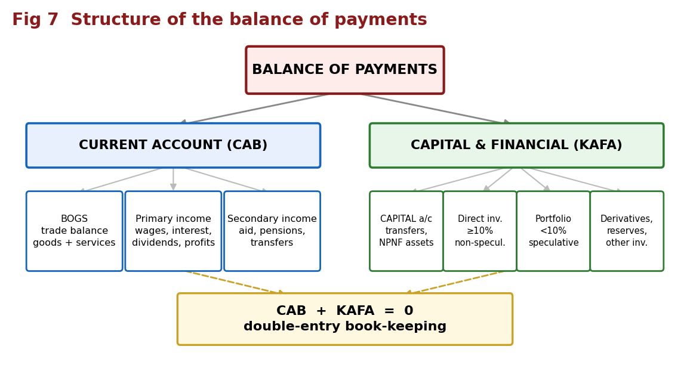
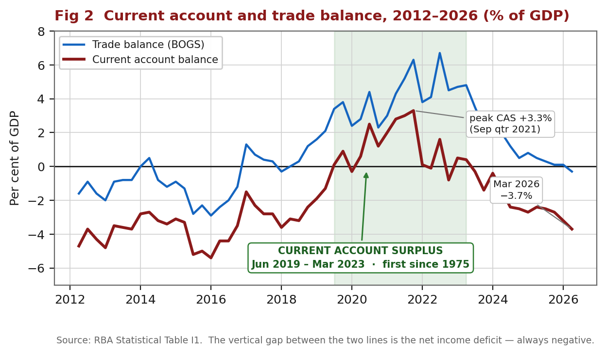
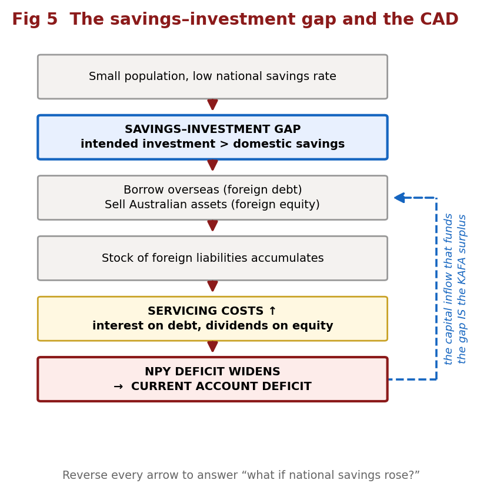
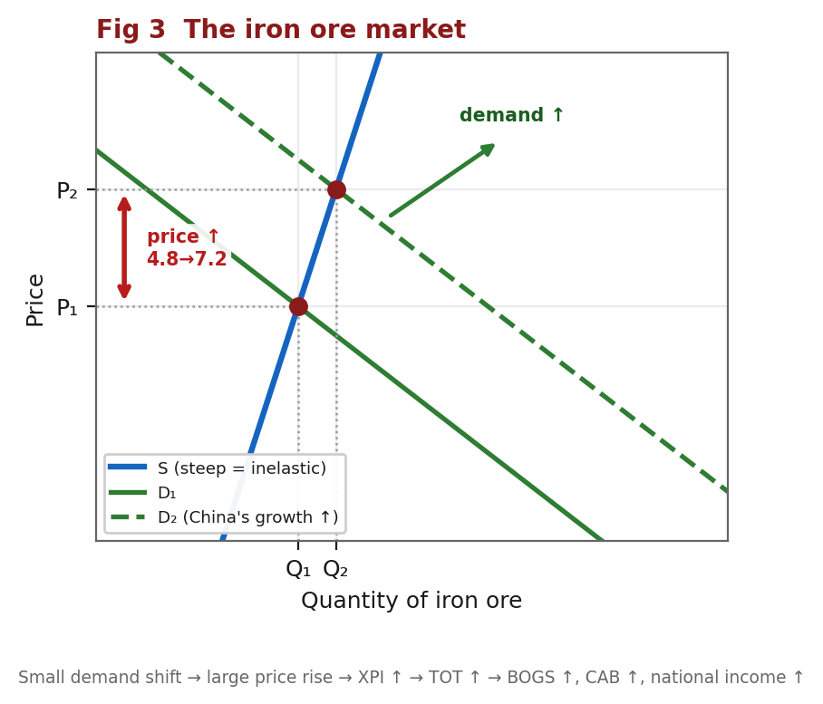
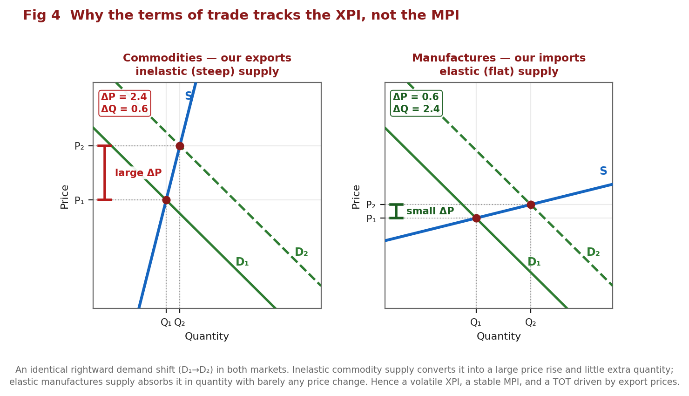
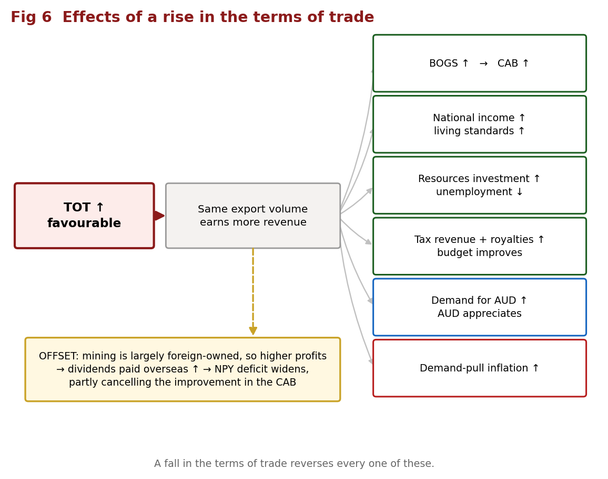
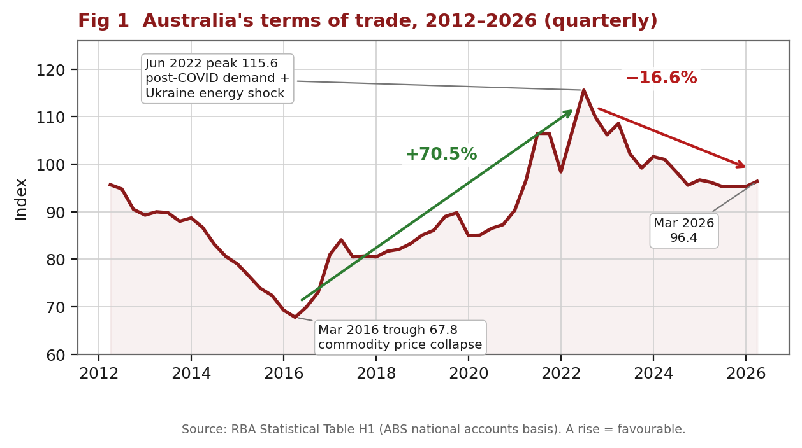

# Economics Task 6 — Balance of Payments & Terms of Trade

**Illustrated study notes.** Everything in the condensed version, expanded, with seven diagrams. Charts are built from live RBA data; the theory diagrams are drawn to exact geometry.

**Assessed:** short answer test, MCQ + short answer/data. Five dot points — the concept and structure of Australia's BOP · reasons for Australia's current account balance · the CAB and the savings/investment gap · the concepts of the terms of trade and the TOT index · the effects of changes in Australia's terms of trade.

## 1. Definitions — write these verbatim

**Balance of payments:** a systematic record of all transactions between the residents of Australia and the residents of the rest of the world over a given period of time. *Residents* = individuals, firms, the government and other organisations operating in Australia. It is a **flow** over a period, not a stock.

**Current account (CAB):** records the value of the flow of **goods, services and income** between Australian residents and the rest of the world. "Current" because what is traded is consumed or received in the current period.

**Capital and financial account (KAFA):** records capital and financial transactions, including **changes of ownership** of Australia's assets and liabilities.

**Terms of trade:** an **index** measuring the **relative movements in the prices of exports and imports** — the ratio of export prices to import prices. It measures **the quantity of imports obtainable in exchange for a given volume of exports**.

**Savings–investment gap:** the gap between Australia's intended level of investment and the level of domestic savings available to fund it.

**Servicing costs:** future financial obligations arising from borrowing funds overseas (**interest**) or attracting foreign investment (**dividends and profits**).

## 2. Formulas

```
CREDIT = money INTO Australia          DEBIT = money OUT of Australia
Net goods    = goods credits − goods debits
Net services = services credits − services debits
BOGS (trade balance) = net goods + net services
CAB = BOGS + net primary income + net secondary income
KAFA = capital account balance + financial account balance

CAB + KAFA = 0          ← always, by double-entry book-keeping
CAB ≈ national savings (S) − investment (I)

TOT index   = (XPI ÷ MPI) × 100
Price index = (total price this year ÷ total price in base year) × 100
% change    = (new − old) ÷ old × 100      ← divide by the OLD value
```

**Net errors and omissions** is the balancing item, included because some transactions are hard to measure accurately and others are missed or omitted entirely.

## 3. Structure of the BOP



| Account | Component | Records | Examples |
|---|---|---|---|
| **Current** | **BOGS / trade balance** | Goods and services exported less imported. **Forms part of GDP**, which is why most attention goes here | Iron ore, coal, LNG, beef ↔ cars, fuel, machinery; tourism, education, freight, insurance |
| | **Primary income** | Income earned from, less paid to, the rest of the world from **working** and from **financial investments** | Wages, dividends, interest, profits |
| | **Secondary income** | Government income/transfers, and transfers where one party provides something **without receiving anything in return** | Foreign aid, pensions, insurance payouts, tax refunds |
| **Capital** | **Capital transfers** | Ownership transferred with nothing specific in return | Debt forgiveness; conditional grants for capital projects (aid to build roads, dams, schools) |
| | **Non-produced, non-financial assets** | **Intangibles** and rights to use natural resources | Brand names, copyrights, trademarks; mining and fishing rights |
| **Financial** | **Direct investment** | Long-term investment in a business with **≥10%** voting power | Buying a factory; 25% of a company. Non-speculative |
| | **Portfolio investment** | Shares or bonds, **<10%**, no influence over operations | 5% of Facebook. More speculative |
| | **Financial derivatives** | Contracts whose value derives from another instrument — these trade **risk**, not funds | Options on rates, currencies, indexes |
| | **Reserve assets** | Reserves held by the **RBA** for FX intervention and IMF commitments | Gold, foreign currency |
| | **Other investment** | The residual | **Trade credit**; **currency and deposits** |

## 4. Credits, debits and double entry

**Current account — intuitive.** Provide something of value → **credit**. Receive something of value → **debit**.

**KAFA — counter-intuitive.** Here credits and debits reflect **changes in ownership of assets and liabilities**, not the direction money moves.

| | KAFA entry |
|---|---|
| Australia's **liabilities increase** OR **assets decrease** | **CREDIT (+)** |
| Australia's **assets increase** OR **liabilities decrease** | **DEBIT (−)** |

> **Why.** Giving up an asset means **supplying a financial asset to the rest of the world** → credit. Acquiring a claim overseas means **acquiring a financial asset from the rest of the world** → debit.

So: Australians buy foreign shares → Australia gains an asset → **debit**. Money leaves an Australian bank account to pay for imports → Australia loses an asset → **credit**.

### The method for any double-entry question

1. Find the account for the **item** being traded, and its sign.
2. The offsetting **money** entry goes in the **financial account** (usually *other investment — currency and deposits*, or *trade credit*) with the **opposite sign**.

- **Export** → CR in the CAB + DR in the FA (currency)
- **Import** → DR in the CAB + CR in the FA (currency)

**Worked — $2m of wheat exported.** CR $2m in the current account (goods), because Australia provides something of value. DR $2m in the financial account: the overseas buyer must obtain AUD, producing an inflow of AUD and an outflow of foreign currency, which is either an increase in Australia's foreign assets or a decrease in its foreign liabilities. Net zero.

**Worked — $5,000 Bali holiday paid from an Australian account.** DR $5,000 in the trade balance as a **services import (tourism)**. CR $5,000 in the financial account under *other investment — currency and deposits*, because Australians now hold $5,000 less — a **reduction in Australia's financial assets**.

**Worked — $100m iron ore export, paid on arrival.** CR $100m goods. DR $100m financial account under *other investment — **trade credit***, because payment is only made after the goods are received.

### Classification drill — cover the right and work down

| Transaction | Account | Sub-section | CR/DR |
|---|---|---|---|
| Coal export to China | Current | Goods | CR |
| Apple iPhone shipment to Australia | Current | Goods | DR |
| Mining company purchasing trucks | Current | Goods | DR |
| Chinese company paying for Australian education | Current | Services | CR |
| Australian spending money in Bali | Current | Services | DR |
| Purchasing shipping for iron ore | Current | Services | DR |
| Overseas company paying interest to an Australian company | Current | Primary income | CR |
| Australian backpacker earns money in London | Current | Primary income | CR |
| Businessman paying interest on a loan to an overseas investor | Current | Primary income | DR |
| US shareholder in Wesfarmers receives a dividend | Current | Primary income | DR |
| Donation to a charity in Africa | Current | Secondary income | DR |
| Chinese business buying 25% of an Australian company | Financial | Direct investment | CR |
| Australian company buying 5% of Facebook | Financial | Portfolio | DR |
| RBA selling gold overseas | Financial | Reserve assets | CR |
| Drawing on a UK bank account to buy an Australian house | Financial | Other investment | CR |
| Buying the rights to the Nando's name in Australia | **Capital** | NPNF assets | DR |

**Traps.** Capital *goods* (trucks, machinery, excavators) are still **goods** in the current account. Brand names, patents and copyrights go in the **capital** account, not the financial account. **10%** is the direct/portfolio boundary. In the KAFA, a credit is **not** "money in".

## 5. BOP calculations

**Worked.** Goods credits 600, goods debits 500, net services −300, net income ?, KAFA +1150.

```
CAB:         CAB + KAFA = 0  →  CAB = −1150        (you need nothing else)
Net income:  net goods = 600 − 500 = +100
             CAB = 100 + (−300) + net income = −200 + net income
             −200 + net income + 1150 = 0  →  net income = −950
```

**Worked — a full table.** Export $40,000 beef; $6,000 Fiji holiday; a Canadian buys $15,000 (3%) of an Australian company; an Australian firm buys a $25,000 German patent.

| | Credit | Debit | Total |
|---|---|---|---|
| **Current account** | +40,000 (beef) | −6,000 (Fiji holiday) | **+34,000** |
| **Capital and financial** | +15,000 (shares) +6,000 +25,000 (currency) | −25,000 (patent) −40,000 −15,000 (currency) | **−34,000** |
| **Totals** | **+86,000** | **−86,000** | **0** |

3% < 10% → **portfolio**. A patent → **capital** account, NPNF assets. Every transaction needs **two** entries, and the table must sum to zero.

## 6. Reasons for Australia's current account balance

**CAB = BOGS + NPY + NSY.** BOGS is volatile and swings between surplus and deficit; **NPY is persistently in deficit**. **Often the NPY deficit exceeds the BOGS surplus, producing a CAD.**

Always address **both** components and state **which dominated**. That final step is where the marks are.



**Read the chart this way.** The blue line is the trade balance, the dark red line is the current account. The **vertical gap between them is the net income deficit** — notice it is always negative, and roughly 2–4% of GDP throughout. The current account only reaches surplus when the trade balance climbs high enough to outweigh that gap, which is exactly what happened from mid-2019.

| | **CAS (surplus)** | **CAD (deficit)** |
|---|---|---|
| | **Net creditor** to the rest of the world; providing an abundance of resources and **owed** money | **Net debtor**; **investing more than it is saving**, using other economies' resources for domestic consumption and investment |

A deficit is **not necessarily bad**, especially for an economy developing or under reform — sometimes an economy must spend now to earn later, so it runs a deficit intentionally.

### Structural vs cyclical — questions ask for this by name

| **STRUCTURAL** | **CYCLICAL** |
|---|---|
| Fundamental factors, mainly affecting the **income balance** | Temporary factors from the business cycle, mainly affecting the **trade balance** |
| Savings–investment gap · foreign investment · foreign liabilities | Domestic business cycle · world business cycle · exchange rates · commodity prices · terms of trade |
| Why the CAD **persists** | Why the CAD **fluctuates** |

### Factors affecting BOGS

| Factor | Change | Chain | CAB |
|---|---|---|---|
| Trading partner growth | ↑ | Exports ↑, particularly minerals and fuels and services → credits ↑ → BOGS ↑ | ↑ |
| **Domestic growth** | ↑ | National income ↑ → households spend more on **discretionary and luxury** goods → consumption imports ↑; firms raise output → **capital and intermediate** imports ↑ → debits ↑ → BOGS ↓ | **↓** |
| Exchange rate | AUD depreciates | Exports cheaper for foreigners, imports dearer → **assuming demand for X and M is price elastic** → X ↑, M ↓ → credits ↑, debits ↓ | ↑ |
| Terms of trade | ↑ | Export prices ↑ relative to import prices → foreigners pay more for our exports → credits ↑ | ↑ |
| Competitiveness | ↑ | Via relative wages, the **inflation differential** and exchange rates → exports more attractive → credits ↑ | ↑ |
| External shocks | — | COVID: X **and** M both fell, but **M fell by more** → BOGS ↑ | either |

Two things markers look for: **domestic growth moves the CAB the opposite way**, and the exchange rate chain **requires the elasticity assumption** to be stated.

### Factors affecting net primary income

**NPY = servicing costs.** Foreign **debt** → **interest**. Foreign **equity** → **dividends and profits**. The NPY is persistently in deficit because Australia is a **net capital importer**, so payments to foreign investors exceed the income we receive on our investments abroad.

The deficit widens with: a **bigger S–I gap**; a **larger accumulated stock** of foreign liabilities; **higher interest rates**; and **higher profits of foreign-owned Australian firms**.

> **The interaction worth a mark.** A rising TOT lifts mining profits, but much of Australian mining is **foreign-owned**, so a large share is paid out as dividends overseas — a primary income debit. A TOT boom therefore improves BOGS while **worsening** the NPY deficit, partly offsetting the gain in the CAB.

## 7. The savings–investment gap



> Australia has a **small population** and a **relatively low national savings rate**, creating a **gap between intended investment and available domestic savings**. To close it, Australia **borrows from overseas (foreign debt)** and **sells ownership of Australian assets (foreign equity)**. Both create **servicing obligations** — interest on debt, dividends and profits on equity — recorded as **primary income debits**. This **increases NPY outflows, widens the NPY deficit and decreases the CAB**. The capital inflow that funds the gap **is** the KAFA surplus, the mirror image of the CAD.

**The identity:** `CAB ≈ S − I`. If **I > S** the gap is funded by foreign capital → **CAD** plus a matching KAFA surplus. If **S > I**, Australia is a net lender → **CAS** plus a KAFA deficit.

**Why the gap exists:** small population → small savings pool; low savings rate; **high investment requirements** as a capital-intensive resource economy (mines, LNG plants, rail, ports, and lately data centres and the energy transition); and Australia is an attractive destination for foreign capital.

**Reverse it — a guaranteed question.** Higher national savings → **smaller S–I gap** → firms fund projects from **domestic savings rather than foreign capital** → **less foreign borrowing and equity** → **fewer NPY outflows** → **smaller NPY deficit** → **CAB rises, CAD shrinks**. And, consistently with the identity, a **smaller KAFA surplus**.

**Is a CAD a problem?** Not if foreign capital funds **productive** investment returning more than its servicing cost, and if the borrowing is voluntary private-sector activity — the *consenting adults* or **Pitchford** view. It is a problem if it funds **consumption** rather than productive investment, or if rising servicing costs and dependence on capital inflow leave Australia exposed to a **sudden stop** or higher global rates. **Conclusion: it depends on what the capital is used for, not on the size of the deficit.**

## 8. The terms of trade and the TOT index

**Rise = FAVOURABLE.** XPI up relative to MPI → we buy **more** imports per unit of exports → **purchasing power up**.
**Fall = UNFAVOURABLE.** MPI up relative to XPI → **fewer** imports per unit of exports → purchasing power down.

**The index level is meaningless on its own — only the change matters.**

**Why it matters:** changes in the XPI and MPI affect the value of total exports and imports, and therefore the **current account**, the **exchange rate** and **national income**.

Both indexes are **weighted** averages, so a large price move in a heavily weighted item drives the whole index — **iron ore** in the XPI, **oil** in the MPI.

### Building an index from raw data

Total the prices for each year; assign a **base year = 100**; every other year is `(total ÷ base total) × 100`.

| | Y1 | Y2 | Y3 |
|---|---|---|---|
| Total export prices | $420 | $410 | $470 |
| **XPI** | **100** (base) | **97.6** | **111.9** |

### Worked calculation

```
XPI 103, MPI 117  →  (103/117) × 100 = 88.0
XPI 109, MPI 119  →  (109/119) × 100 = 91.6
% change = (91.6 − 88.0) ÷ 88.0 × 100 = +4.1%   → favourable
```

### The traps

> **Percentage points ≠ per cent.** 95.5 → 97.4 is a rise of **1.9 index points** but **2.0 per cent** (1.9 ÷ 95.5). Read the wording, and always divide by the **older** value.
>
> **Price indexes tell you nothing about values or volumes.** Given only XPI and MPI you cannot conclude anything about export revenue or quantities. This is the most common MCQ distractor in the topic.
>
> **"TOT fell" does not mean "exports fell".** The TOT can fall while export prices *rise*, if import prices rise by more.

### The four combinations

**TOT rises when:** XPI ↑ and MPI flat · MPI ↓ and XPI flat · **both ↑ but XPI ↑ by more** · **both ↓ but MPI ↓ by more.** Flip all four for a fall.

**MCQ shortcut:** `%ΔTOT ≈ %ΔXPI − %ΔMPI`. For June quarter 2026: XPI +1.1%, MPI +5.7% → ≈ **−4.6%** (exact −4.35%). Close enough to pick the option; use the full formula if asked to *calculate*.

## 9. Factors affecting the terms of trade

Australia is a **price taker** for both exports and imports, because we are a medium-sized economy — **world markets set our X and M prices, not us.**

### Commodity prices — the dominant driver

About **75%** of Australia's exports are commodities. Their **demand and supply are both inelastic**, giving **steep curves**, so **small shifts in D or S produce large price swings**.

| Why demand is inelastic | Why supply is inelastic |
|---|---|
| Few global substitutes | **Long production lags** — mines and crops take years to adjust |
| A small proportion of the final good's cost | **High capital requirements** — hard to scale quickly |
| A **necessity for production** — can't stop using them short-run | **Geographic and climate constraints** |
| **Long-term global contracts** dampen responsiveness | **Regulatory and infrastructure limits** |



When China's economy expands, world demand for iron ore shifts right (D₁→D₂). Along a **steep supply curve** the price rises sharply from P₁ to P₂ with only a small quantity increase. Exporters sell **more at a higher price** → **XPI ↑ → TOT ↑ → BOGS ↑ → CAB ↑** and **national income ↑**. Reverse it for a Chinese slowdown.

### Manufactured goods prices

Most of Australia's **imports** are manufactured and intermediate goods — appliances, equipment, machinery, ICT. Their **supply is elastic** (a flat supply curve), so demand shifts have **little effect on price**. As China became the world's largest manufacturer, and with productivity and technology gains, manufactured and ICT prices have **trended down** → **MPI ↓ → TOT ↑**.

*Exception:* during COVID, **supply bottlenecks** cut supply → import prices ↑ → **MPI ↑ → TOT ↓**.

### Oil prices

Volatile and inelastic, and Australia is a **significant importer**. Higher oil prices raise **energy and transport costs across nearly all import prices**. But they also lift the price of our energy **export substitutes** — coal and LNG — so the net TOT effect depends on the relative weights. In 2016–19 the export effect dominated via LNG; in 2022 both indexes rose together.

### Why the TOT tracks the XPI, not the MPI



This is the single most useful diagram in the topic. **The same demand shift** produces a price rise **four times larger** in the commodity market than in the manufactures market, because commodity supply is inelastic and manufactures supply is elastic. Hence a **volatile XPI**, a **stable MPI**, and a TOT driven almost entirely by **export prices**. Over the past decade the XPI ranged over about **60** index points against the MPI's **29**.

## 10. Effects of changes in the terms of trade



A rise means the **same volume of exports earns more revenue**. Don't just list the effects — give the mechanism.

| Effect | Mechanism |
|---|---|
| **BOGS ↑ → CAB ↑** | Export credits rise relative to import debits |
| **National income ↑, living standards ↑** | Higher export revenue becomes higher incomes and profits; more imports per unit of exports raises **real purchasing power** |
| **Investment ↑, unemployment ↓** | Higher expected profitability of resource projects → investment ↑ → **derived demand for labour** ↑ |
| **Government revenue ↑** | Company and income tax receipts plus state **royalties** ↑ → budget improves |
| **AUD appreciates** | Foreign buyers must buy more AUD; higher expected returns attract capital inflow → demand for AUD ↑ |
| **Inflation ↑** | Higher incomes and profits raise aggregate demand → **demand-pull** pressure, especially near capacity — *partly offset* because an appreciating AUD makes imports cheaper |

**Causes of a rise:** higher commodity prices; natural disasters lifting rural prices; falling global oil prices; lower manufacturing costs; technology lowering ICT prices. **Causes of a fall:** lower commodity prices; higher global oil prices; supply bottlenecks; higher manufacturing costs.

**A fall reverses every row.** And note: a falling TOT **reduces** growth prospects and **reduces** national economic welfare — a common MCQ has you pick the opposite.

## 11. Trends over the last ten years



| Period | Movement | Why |
|---|---|---|
| 2014–16 | TOT and CAB **falling** | Commodity prices collapse — iron ore US$180→US$40/t (2011–15); China slowing; global oil US$48→US$32 in late 2015 as sanctions on Iran ended. MPI stable. TOT troughed at **67.8** in Mar 2016 |
| 2016–19 | TOT **rising**, CAB rising but still CAD | XPI up ~40% on coal and iron ore with strong Chinese growth; OPEC stabilised supply, lifting oil and therefore **LNG** demand. MPI also rose but **by less**. NPY deficit widened too, as profits of largely foreign-owned firms rose |
| 2020 | TOT small **fall**; CAB **rising** | COVID recession cut XPI (LNG, coal); MPI fell too (oil collapse, strong AUD). **M fell more than X** → BOGS ↑ |
| 2020–22 | TOT **rising** to its peak | Recovery demand for raw materials; Ukraine war lifted energy. Peak **115.6 in Jun 2022** — a **+70.5%** rise from the 2016 trough |
| **Jun 2019 – Mar 2023** | **CURRENT ACCOUNT SURPLUS — first since 1975** | Driven by a **record BOGS**, peaking at **6.7% of GDP**, on bulk commodity prices, with iron ore driving record metal ores exports. **NPY stayed in deficit** — so the CAS was a **trade** story, not an income one. Peak CAS **+3.3% of GDP** in Sep 2021 |
| 2023–25 | TOT and CAB **falling**, back to **CAD by 2024** | China slowdown → iron ore ↓ → XPI ↓ (MPI fell too, but **XPI fell by more**). Domestic recovery → income ↑ → imports ↑. Rising foreign investment → dividends ↑ → NPY deficit ↑ |
| 2025–26 | CAD **widening sharply** | Mar qtr 2026 CAD **$27.1b**, up from $23.0b, and **−3.7% of GDP**. Primary income paid overseas **+$1.6b** on stronger dividends; trade surplus fell $5.2b to $3.9b; **first monthly goods deficit since Dec 2017**. TOT down **−16.6%** from its peak |
| Jun qtr 2026 | TOT **≈ −4.4%** | **XPI +1.1% vs MPI +5.7%** — the biggest MPI rise since Dec 2021, driven by fuel. Iron ore weak on Chinese stockpiles, strong global supply and anti-dumping measures |

**KAFA is the mirror of the CAB.** Australia has historically been a **net recipient of capital inflow**, supplementing domestic savings to fund high investment — a **KAFA surplus, the counterpart of our CAD**. In recent years there have been periods of **net capital outflow**, with Australians investing more abroad than foreigners invested here — a **KAFA deficit**, consistent with the shift to a current account surplus. If a question tells you one, immediately state the other.

> **⚠ Index levels differ between series — read the data table you're given.** Your class deck quotes a TOT peak of **128 index points** in the September quarter 2021. The chart above shows a peak of **115.6 in June 2022**. Both can be correct: the class figure is the **goods-only trade price index** on an **older base year**, while this chart is the **national accounts** TOT (goods *and* services) on the current base. Index numbers are **not comparable across different bases or series** — which is exactly why the syllabus stresses that **only the change matters**. In the exam, use whatever indexes the data table gives you and never mix series.

## 12. Statistics worth quoting

CAD **$27.1b** / **−3.7% of GDP** (Mar qtr 2026), up from $23.0b · first monthly goods deficit since **Dec 2017** · trade surplus fell **$5.2b to $3.9b** · primary income paid overseas **+$1.6b** · **XPI +1.1% vs MPI +5.7%** (Jun qtr 2026) → TOT **≈ −4.4%** · TOT trough **67.8** (Mar 2016) → peak **115.6** (Jun 2022) = **+70.5%**, then **−16.6%** to **96.4** · CAS **Jun 2019 – Mar 2023**, first since **1975**, peaking at **+3.3% of GDP** · trade balance peaked at **6.7% of GDP** · iron ore **US$180 → US$40/t** (2011–15) · commodities **~75%** of exports · XPI range **60** vs MPI range **29**

## 13. Exam technique

**Command words.** *Identify/State* — one word or figure, no explanation. *Define* — formal wording. *Calculate* — formula, substitution, answer **with units**. *Describe* — what happened: direction, magnitude, dates. *Distinguish* — both items with an explicit "whereas". *Explain* — why, as a **causal chain**. *Analyse* — components and relationships, using the data. *Evaluate/Discuss* — both sides plus a justified judgement.

**Every "explain" answer:**

```
cause → effect on X/M or credits/debits → effect on BOGS or NPY → effect on the CAB
```

**Calculations.** Write the formula first — often worth a mark by itself. Substitute visibly. Give **units** (%, $m, index points). Divide by the **old** value. Check whether the question wants **index points** or **per cent**. State the **direction**, and for the TOT say **favourable** or **unfavourable**.

**Trend answers need four things:** overall direction · quantified start and end with dates · any turning point · the cause as a chain.

**Graph reading.** State the units. For "identify the value" questions markers accept a **range**, so read the axis carefully but don't agonise — just never omit the unit.

**Before you hand it in.** Units on every calculation · an arrow chain in every "explain" · a figure and a date in every trend answer · **both BOGS and NPY** addressed in every CAB question · favourable/unfavourable stated in every TOT question · the **elasticity assumption** stated in any exchange rate chain.

**Sources.** Charts built from RBA Statistical Tables H1 (terms of trade) and I1 (international trade and balance of payments); quarterly figures from ABS Balance of Payments and International Trade Price Indexes releases. Content summarised and rephrased for licensing compliance.
