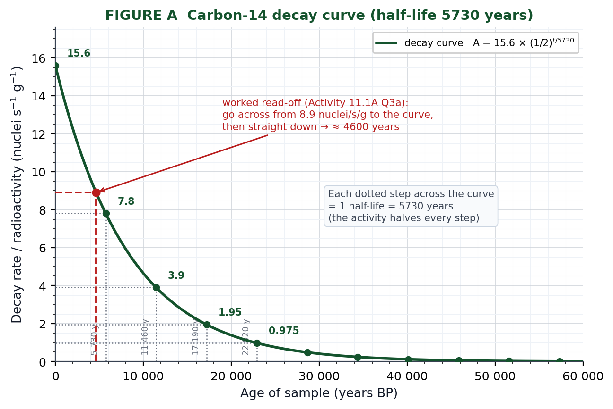
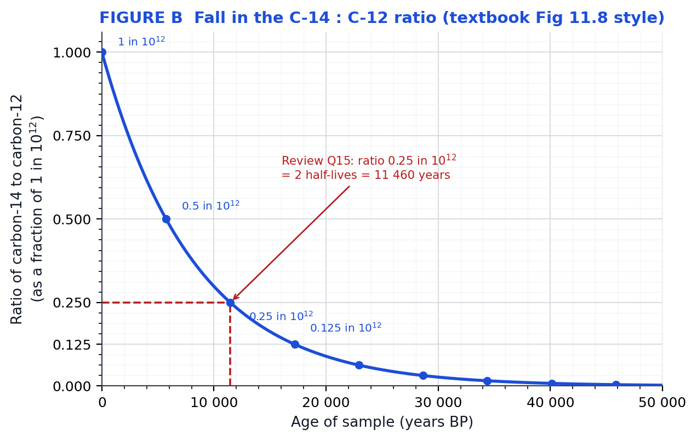
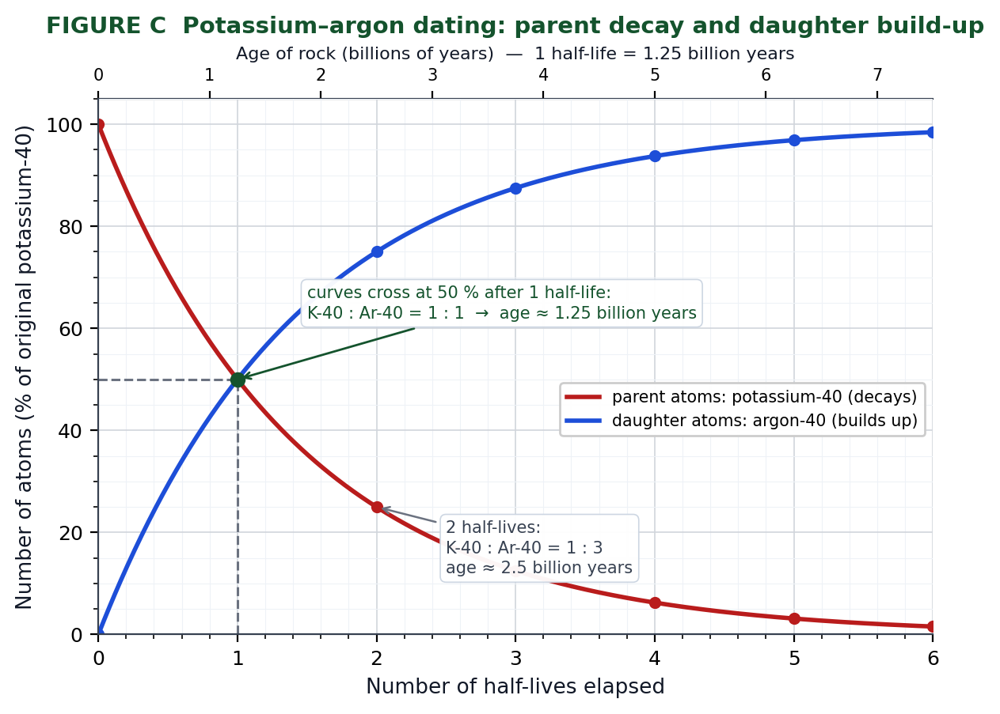
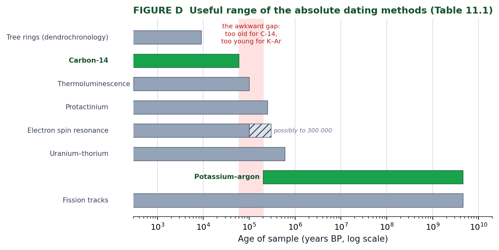
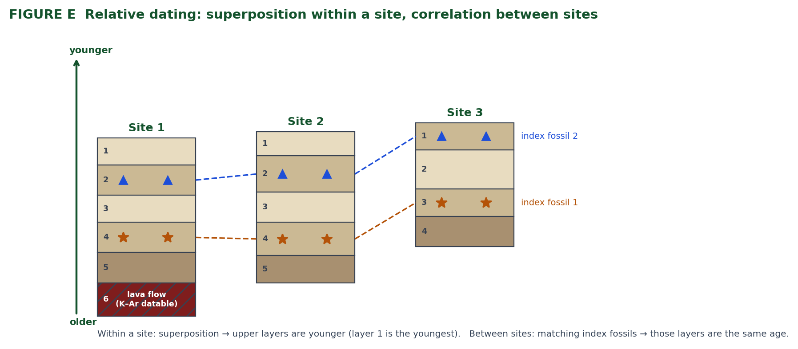
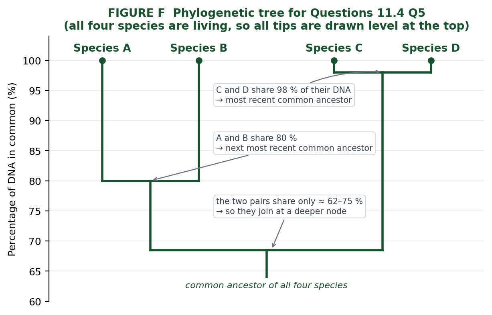

# Task 6: Investigating Fossil Dating — Complete Study Pack

**Course:** ATAR Human Biology Units 3 & 4 (ATHBY), Kent Street SHS, 2026
**Sources used:** `KSSHS_Course_Outline_(1)_ATHBY_2026_v2.docx` (Weeks 26–27 row) and `hp12wa8e_11_Otherevidenceofevolution.pdf` (Human Perspectives ATAR Units 3 & 4, **Chapter 11 "Other Evidence of Evolution", pp. 295–321**)

---

## 1. What the outline actually says about Task 6

| Field | Detail |
|---|---|
| Task | **Task 6: Investigating Fossil dating** |
| Timeline | **Weeks 26–27** (Semester 2, Unit 4) |
| Topic | **Evidence for evolution** |
| Textbook | **CH 11 (pp. 295–321)**, Review Questions **pp. 320–321**, plus AYKQ |

**Syllabus content examined by this task (verbatim from the outline):**

- Evolutionary relationships between groups can be represented using phylogenetic trees (*construction of phylogenetic trees is NOT required*).
- The fossil record is incomplete and cannot represent the entire biodiversity of a time or location, due to many factors affecting fossil formation, the persistence of fossils, and accessibility of fossilised remains.
- Sequencing a fossil record requires a **combination** of relative and absolute dating techniques to place fossils onto the geological timeline.
- Both relative techniques (**stratigraphy, index fossils**) and absolute techniques (**radiocarbon, potassium–argon**) have **limitations of application**.

**Learning intentions listed for these weeks:**

- Fossils and fossil **formation**
- **Problems and limitations** of the fossil record
- **Application and limitations** of relative dating: stratigraphy and index fossils
- **Application and limitations** of absolute dating: radiocarbon and potassium–argon
- **How these techniques are represented graphically** and used to accurately date a fossil

> Note: the outline names the task but does **not** state its weighting, duration, or format. Because it is called an *"Investigating…"* task and the syllabus dot point about **graphical representation** is explicitly listed, expect a **Science Inquiry / data-analysis style task**: decay curves, stratigraphic columns, half-life calculations, and evaluation of reliability, validity and limitations. It maps directly onto textbook **Activity 11.1 (Investigating radioisotope methods of dating)** and **Activity 11.2 (Investigating stratigraphy)** — do both of these before the task.

Every question set in the chapter is worked in **§10** — Questions 11.1–11.4 and the end-of-chapter Review Questions.

Also expect the Week 1 **Science Inquiry Skills** to be assessed alongside the content: hypotheses and predictions, analysing data, identifying trends/patterns, discussing measurement error, instrument accuracy, procedure and sample size as sources of limitation, and justifying conclusions with evidence.

---

## 2. Fossils (Ch 11.1)

**Fossil:** any preserved trace left by an organism that lived long ago.
Forms: bones, teeth, shells, footprints, burrows, faeces (coprolites), impressions of part or all of a plant/animal. For human ancestors: usually bones, teeth, occasionally footprints.

**Artefact:** an object deliberately made or modified by humans — stone tools, beads, carvings, charcoal from cooking fires, cave paintings. (An artefact is *made*; a fossil is *organic remains/traces*.)

### Four conditions required for fossilisation
1. **Rapid burial** of the material (drifting sand, river mud, volcanic ash, deliberate burial by other members of the species).
2. Presence of **hard body parts** (bone, teeth, shell).
3. **Absence of decay organisms** (decomposers) / low oxygen.
4. A **long period of stability** — remains left undisturbed.

### Effect of soil type
- **Wet, acidic soil** → minerals in bone dissolve → **no bone fossilisation**.
- **Acidic + oxygen-free (e.g. peat bogs)** → **soft tissue** preserved (skin, hair, gut contents), but bones demineralised.
- **Alkaline soil** → **best bone fossils**: minerals are not dissolved; new minerals (lime, iron oxide) are deposited in bone pores, replacing the organic matter (~35% of bone by weight) → bone becomes **petrified** but structural detail is preserved.

### Where human-ancestor fossils are found (and why)
- Edges of **ancient lakes and rivers** — sediment builds up quickly during floods/slowed flow → rapid burial.
- **Caves** — often limestone (calcium carbonate) deposited around remains; roof/wall collapse buries bodies.
- **Volcanically active areas** — usually heat destroys remains, **but** East African **ash falls** have preserved many hominin fossils.

### Excavation ("a dig")
Site surveyed and marked into sections → **small hand tools** used so material isn't damaged → removed soil **sieved** so tiny fragments aren't lost → photographs at every stage to record positions → each item labelled and catalogued → in the lab: bones scraped clean, fragments pieced together, measurements taken, plaster casts or latex moulds made.

### Reconstruction problem
Whole skeletons are rare (e.g. *Homo ergaster* skull from Kenya, ~1.8 My, reconstructed from fragments with missing areas estimated). Reconstructions are **approximations based on expert judgement**, so different scientists interpret differently → controversy. The only resolution is finding more fossils.

---

## 3. Dating fossils (Ch 11.2)

- **Absolute date** — the **actual age in years** of the specimen.
- **Relative date** — whether a specimen is **older or younger** than another specimen (or than the rock/soil it's in). Establishes a **sequence** of events.
- Ages are given as **years BP** = "before present" (e.g. 45 000 years BP = 45 000 years old).

### 3.1 Potassium–argon dating (absolute)
- Potassium (**K**) is one of the most abundant elements in Earth's crust; occurs as three isotopes — K-39 (20 n), K-40 (21 n), K-41 (22 n). **Isotopes** = atoms of the same element (same protons) with different neutron numbers.
- **K-40 is radioactive** and decays to **calcium-40** and **argon-40** at an extremely slow but **constant** rate.
- As the rock ages: **K-40 decreases, Ar-40 increases** → measuring the **K-40 : Ar-40 ratio** gives the rock's age (Figure 11.6 = parent-decay / daughter-buildup curves crossing at 1 half-life).
- **Half-life of K-40 = 1.25 × 10⁹ years (1.25 billion = 1250 million years).**
  ⚠️ The chapter text contains a **typo**: "1250 billion years (1.25 × 10⁹ years)". The bracketed figure is correct (1.25 billion); Activity 11.1B quotes "around 1300 million years". Use **1.25 billion years** and expect either figure to be accepted.

- **Argon is a gas** — it escapes from molten lava, so the "clock" starts when the lava **solidifies**; trapped Ar-40 in solid lava must therefore have come from K-40 decay.

**Limitations of potassium–argon dating**

- Only works on **suitable rock types** — volcanic/lava deposits (not all rocks are suitable).
- Only useful for material **older than ~200 000 years** (theoretical limit 100 000–200 000). After 100 000 years only **0.0053%** of K-40 has decayed — below reliable detection limits.
- It dates the **rock, not the fossil** — you need volcanic rock **of the same age** adjacent to (e.g. burying) the fossil, and the fossil's age is then **inferred**.
- Cannot be used directly on bone or any organic material.
- Contamination or argon leakage/atmospheric argon inclusion reduces accuracy.

### 3.2 Radiocarbon (carbon-14) dating (absolute)
- **C-14 is produced in the upper atmosphere** by cosmic radiation acting on nitrogen, at about the same rate as it decays; it **decays back to nitrogen-14**.
- Atmospheric ratio ≈ **1 C-14 atom : 10¹² C-12 atoms**.
- Plants fix atmospheric CO₂ in **photosynthesis** → C-14 enters plant tissue → animals eat plants → C-14 enters animal tissue. **At death, intake stops** but decay continues at a fixed rate.
- Measuring radiation released (or counting atoms) gives the **C-14 : C-12 ratio** → age.
- **Half-life = 5730 ± 40 years.** Ratio falls 1 → 0.5 → 0.25 → 0.125 (per 10¹²) each 5730 years.
- **Conventional method** needs **≥ 3 g** of organic material.
- **AMS (accelerator mass spectrometry) radiocarbon dating** breaks the sample into constituent atoms and counts isotope atoms — works on as little as **100 µg (0.0001 g)**. This allows accurate dating of **cave-painting pigments**, which often contain charcoal or organic binders (honey, milk, blood, oil seed).

**Limitations of radiocarbon dating**

- Material must contain **organic (carbon) compounds** — i.e. it must once have been living.
- Maximum useful age ≈ **60 000 years** (by ~70 000 years only **0.021%** of C-14 remains — too little to measure accurately).
- The atmospheric **C-14 : C-12 ratio is not constant** (it was once assumed to be) → dates must be treated with caution. **Corrections** are possible for roughly the **last 9000 years** using independent evidence such as **tree-ring dating (dendrochronology)**.
- Contamination with older or modern carbon skews results; small samples increase error.
- Because bones are often mineralised/petrified (organic matter replaced), fossil bone is frequently undatable by C-14 — the associated **charcoal from hearths** is dated instead and the artefact age deduced.

### 3.3 Table 11.1 — Useful range of common absolute dating methods

| Method | Material used | Useful range (years BP) |
|---|---|---|
| Tree growth rings (dendrochronology) | Wood | Up to 9 000 |
| **Carbon-14** | Carbon compounds | Up to 60 000 |
| Protactinium | Sea sediments | Up to 250 000 |
| Uranium–thorium | Sea sediments, coral | Up to 600 000 |
| **Potassium–argon** | Volcanic deposits | 200 000 and earlier |
| Electron spin resonance | Calcium carbonate (shells, coral, teeth), quartz, flint | Up to 100 000, possibly 300 000 |
| Fission tracks | Minerals and glass | 100 years ago to 4550 million |
| Thermoluminescence | Sediments, lava, ceramics | 300 years ago to 100 000 |

*(Only C-14 and K–Ar are examinable in detail; the rest show that methods overlap and are chosen to suit the sample and age range.)*

This table is drawn as a timeline in **Figure D (§5.5)** — worth a look, because it makes the 60 000–200 000 year gap between radiocarbon and potassium–argon obvious.

### 3.4 Relative dating — stratigraphy
**Stratigraphy** = the study of layers (strata). Two uses:

**(a) Principle of superposition** — in undisturbed sedimentary rock, **upper layers are younger than those beneath**, so fossils/artefacts in upper layers are younger.
*Limitations / when it fails:*

- **Distortions of Earth's crust** (folding, faulting, tilting, overturning) can invert or offset a sequence.
- Fossils/artefacts can be **buried later** by animals (burrowing) or by early humans (digging, graves) → the specimen may be **younger** than layers above it.
- Erosion can remove layers; material can wash or fall down cracks.

**(b) Correlation of rock strata** — matching layers between different areas (sometimes thousands of km apart) by examining the rock itself and the fossils it contains. **Rocks containing the same fossils are assumed to be the same age.**

**Index fossils** — fossils that are especially useful for correlation because they:

1. were present on Earth for only a **short, limited period of time**;
2. are **widely (geographically) distributed**;
3. are **abundant** in the strata; and
4. are **easily recognised/identified**.
Examples: **trilobites** (lived ~500–300 Mya then went extinct), ammonites, and some **fossil pollen grains**.

See **Figure E (§5.9)** for a worked stratigraphic diagram showing superposition within a site and index-fossil correlation between sites.

**Fossil pollen (palynology)** — some pollen grains work as index fossils; even when they don't, preserved pollen lets a botanist reconstruct the **type and amount of vegetation**, and hence the **climate**, at the time the deposit formed. This can **confirm or refute** relative dates obtained by other methods.

### 3.5 Why relative and absolute dating are used together
Absolute methods each need a **particular set of circumstances** (right material, right age range). When those aren't available, relative methods still establish the **sequence**. Combining them lets a fossil be placed on the **geological timeline**: e.g. a layer bracketed between two K–Ar-dated lava flows must be between those ages; a layer correlated by index fossils to a C-14-dated layer elsewhere inherits that age.

---

## 4. Problems and limitations of the fossil record (high-frequency exam question)

1. **Fossilisation is a chance event** — the four required conditions rarely coincide, and occur irregularly in time, so there are **gaps**.
2. Soft-bodied organisms and **soft tissues** (skin, muscle, organs) are rarely preserved → record biased toward **hard parts** (bone, teeth, shell) and toward organisms living in depositional environments.
3. Acidic/wet soils **destroy** bone; heat (volcanic) destroys remains.
4. Only a **very small proportion** of existing fossils have been **discovered**: some are buried too deep, some are in **inaccessible** places.
5. Some are **not recognised** as fossils, or are **destroyed inadvertently** by agriculture, industry, construction, war.
6. Fossils are usually **fragmentary** → reconstructions are interpretive and disputed.
7. **Dating is often problematic** — C-14 needs carbon and works only to ~60 000 years; K–Ar needs suitable volcanic material and only works beyond ~200 000 years; so some fossils fall in awkward gaps or lack datable associated material.
8. Therefore the fossil record **cannot represent the entire biodiversity** of any time or place.

---

## 5. Graphical representation and calculations (the "investigating" part)

This is the part of the syllabus the outline flags explicitly — *"how these techniques are represented graphically and used to accurately date the fossil"* — so it is the most likely place for marks in Task 6.

### 5.1 How to sketch a decay curve — step by step

**Step 1 — Build the data table before you draw anything.** Halve the starting quantity repeatedly and add one half-life to the age each time. Go to at least 5–6 half-lives so the flattening tail is obvious.

**Step 2 — Put the variables on the correct axes.** Time (age, or number of half-lives) is the **independent** variable and goes on the **x-axis**. The measured quantity (decay rate, % remaining, mass of parent, C-14 : C-12 ratio) is the **dependent** variable and goes on the **y-axis**.

**Step 3 — Label both axes with the quantity *and* its unit.** e.g. `Age of sample (years BP)` and `Decay rate (nuclei s⁻¹ g⁻¹)`. More marks are lost here than anywhere else on a graphing question.

**Step 4 — Choose a sensible scale.** Start both axes at zero (a decay curve must show the t = 0 starting value), use even increments (1, 2, 5, 10, 20, 50…), keep the increments constant, and make the plotted data fill at least half the grid in both directions.

**Step 5 — Plot and draw.** Mark each point with a small neat dot or cross, then draw a **single smooth curve** through them. Never join the points with ruled straight segments, and never let the curve touch or cross the x-axis — radioactive decay approaches zero but never reaches it (it is asymptotic).

**Step 6 — Show the half-life on the graph.** Draw one "staircase": a horizontal construction line from half the starting value across to the curve, then a vertical line down to the x-axis. Label it **"1 half-life = 5730 years"**. This demonstrates you understand what the graph *means*, not just how to plot it.

**Step 7 — Read values off with dashed construction lines**, and quote the answer with units and a sensible precision (e.g. "≈ 4600 years", not "4638.2 years" — you read it off a graph).

**Marking-point checklist for any graph you draw**

| ✔ | Marking point |
|---|---|
| 1 | Correct variable on each axis (time on x) |
| 2 | Both axes labelled with quantity **and** unit |
| 3 | Even, sensible scale; origin included |
| 4 | Points plotted accurately (within half a small square) |
| 5 | Smooth curve, not dot-to-dot; curve does not hit the x-axis |
| 6 | Half-life shown/labelled, or key values annotated |
| 7 | Title, or a clear statement of what the graph shows |

**Common mistakes that cost marks**

- Ruling straight lines between points (turns an exponential curve into a zigzag).
- Forgetting units on the y-axis, or writing "amount" instead of the actual measured quantity.
- Uneven x-axis increments (e.g. 5730, 11 460, 20 000, 30 000).
- Letting the curve flatten *onto* the axis, or stopping the curve at the last point instead of continuing the trend.
- Reading a value without drawing the construction lines (examiners want to see the method).
- Plotting *age* on the y-axis out of habit.
- Using the C-14 curve for a rock, or the K–Ar curve for charcoal.

### 5.2 Figure A — the carbon-14 decay curve (activity against age)

This is the graph to reproduce for **Activity 11.1A**. Starting activity 15.6 nuclei/s/g halves every 5730 years. Note how the dotted "staircase" works: across from 7.8 to the curve, down to 5730 y; across from 3.9, down to 11 460 y; and so on. The red dashed lines show the read-off method for Q3a — enter the graph at the measured activity, go across to the curve, then straight down to the age.

### 5.3 Figure B — the C-14 : C-12 ratio curve (textbook Fig 11.8 style)

Same physics, different y-axis: this version plots the **ratio** of C-14 to C-12 as a fraction of the living value of 1 in 10¹². Use this one when a question gives you a ratio rather than a decay rate — as Review Q15 does (0.25 in 10¹² = two half-lives = 11 460 years).

### 5.4 Figure C — potassium–argon parent/daughter curves (textbook Fig 11.6 style)

**How to sketch it:** x-axis = number of half-lives (or age in billions of years); y-axis = number or % of atoms. Draw the **parent (K-40)** curve falling from 100%, and the **daughter (Ar-40)** curve rising from 0% as its mirror image. The two must **cross at 50% after exactly one half-life**, and parent + daughter must always add to 100%.

| K-40 : Ar-40 ratio | % parent remaining | Half-lives elapsed | Age of rock |
|---|---|---|---|
| all parent, no daughter | 100% | 0 | just solidified |
| 1 : 1 | 50% | 1 | 1.25 billion years |
| 1 : 3 | 25% | 2 | 2.5 billion years |
| 1 : 7 | 12.5% | 3 | 3.75 billion years |
| 1 : 15 | 6.25% | 4 | 5 billion years (older than Earth — so you would not see this) |

### 5.5 Figure D — which method for which age

Table 11.1 drawn as a timeline (log scale). Use it to justify a **choice** of technique, which is exactly what "limitations of application" questions ask. Note the shaded band: between about **60 000 and 200 000 years** a sample is too old for radiocarbon and too young for potassium–argon, which is why thermoluminescence, ESR and uranium-series methods matter, and why relative dating is still needed.

### 5.6 Half-life maths — both directions

**Rule:** after *n* half-lives the fraction remaining = (1/2)ⁿ → 50%, 25%, 12.5%, 6.25%, 3.125%…  and **age = n × half-life**.

**(a) Given the amount, find the age.**
fraction = measured ÷ original → count how many halvings that is (*n*) → age = *n* × 5730.
*Example:* 1.5 nuclei/s/g from a start of 15.6 → 15.6 ÷ 1.5 = 10.4. Since 2³ = 8 and 2⁴ = 16, *n* is between 3 and 4 — precisely log₂10.4 = 3.38 → **age ≈ 3.38 × 5730 ≈ 19 400 years**. Without a log button, read it off Figure A or bracket it: "between 17 190 and 22 920 years".

**(b) Given the age, find the amount.**
*n* = age ÷ half-life → remaining = original × (1/2)ⁿ.
*Example:* 9000 years → n = 9000 ÷ 5730 = 1.57 → (1/2)^1.57 = 0.337 → 15.6 × 0.337 = **≈ 5.3 nuclei/s/g**.

**(c) Parent : daughter shortcut (K–Ar).** Convert the ratio to "fraction of parent left", then count half-lives: 1:1 → 1/2 left → 1 half-life; 1:3 → 1/4 left → 2 half-lives; 1:7 → 1/8 left → 3 half-lives. Multiply by 1.25 billion years.

### 5.7 Activity 11.1A — Radiocarbon decay table (worked)
Starting decay rate for living/recently dead material = **15.6 nuclei/s/g**; half-life 5730 y.

| Half-lives | Age (years) | Radioactivity (nuclei/s/g) | Fraction remaining |
|---|---|---|---|
| 0 | 0 | 15.6 | 100% |
| 1 | 5 730 | 7.8 | 50% |
| 2 | 11 460 | 3.9 | 25% |
| 3 | 17 190 | 1.95 | 12.5% |
| 4 | 22 920 | 0.975 | 6.25% |
| 5 | 28 650 | 0.4875 | 3.125% |
| 6 | 34 380 | 0.244 | 1.56% |
| 7 | 40 110 | 0.122 | 0.78% |
| 8 | 45 840 | 0.061 | 0.39% |
| 9 | 51 570 | 0.030 | 0.20% |
| 10 | 57 300 | 0.015 | 0.10% |

Plot decay rate (y) against age (x) to 60 000 years, join with a **smooth curve** (not a ruled line), label axes with units, and read values by interpolation.

**Worked answers to Activity 11.1A Q3** (read off the curve; calculated values shown):

- **(a)** Charcoal at 8.9 nuclei/s/g → 8.9/15.6 = 0.571 remaining → ≈ **0.81 half-lives ≈ 4600 years old** (graph read ~4500–5000 y).
- **(b)** Wood of 9000 years → 9000/5730 = 1.57 half-lives → 0.337 remaining → ≈ **5.3 nuclei/s/g** (graph read ~5–5.5).
- **(c)** If the wood is much **older** than the 9000-year tools: the wood came from an already-old tree/timber that was **re-used** or was already dead when deposited; older material was **redeposited/washed in**, or the deposits were **disturbed** (burrowing animals, human digging, roof collapse, trampling) mixing layers; sample **contaminated** with old carbon; the tools may have been misdated.
- **(d)** If the wood is much **younger**: it was introduced **later** — fell/washed down a crack, carried down by **burrowing animals or plant roots**, buried by later human activity that dug into older deposits; or the sample was **contaminated with modern carbon** (handling, humic acids, recent rootlets).
- **(e)** Bone at 1.5 nuclei/s/g → 15.6/1.5 = 10.4 → log₂10.4 = 3.38 half-lives → ≈ **19 400 years old** (graph read ~19 000–20 000). *(Only possible if collagen/organic carbon survives.)*
- **(f)** Wood tree-ring dated at 4000 y → 4000/5730 = 0.70 half-lives → 0.616 remaining → ≈ **9.6 nuclei/s/g**.

### 5.8 Activity 11.1B — Potassium–argon (method for the volcano diagram)
Layers **A, C, E, G = lava**; layers **B, D, F = sediment** deposited between eruptions.

- **Q1 — Why no Ar-40 in layer A?** A is the **youngest/most recent** lava. Argon-40 is a gas that escapes while lava is molten, so the clock starts on solidification; insufficient time has passed for a **detectable** amount of K-40 (half-life 1.25 billion years) to decay to Ar-40.
- **Q2 — Ratio in layer E:** count symbols: ratio = K-40 atoms : Ar-40 atoms. Convert to half-lives — 1:1 ⇒ 1 half-life ⇒ ~1.25 billion y; 1:3 ⇒ 2 half-lives ⇒ ~2.5 billion y. State the ratio in simplest form, then the age.
- **Q3 — What is the material in B, D, F?** **Sedimentary** material (sand/silt/mud/ash weathered and deposited by wind and water) laid down **between eruptions** during the long quiet intervals, then buried by the next lava flow.
- **Q4 — Why no fossils in A, C, E, G?** The **extreme heat of molten lava incinerates/destroys** organisms and their remains, so nothing is preserved in igneous layers.
- **Q5 — Conditions assisting fossilisation:** rapid burial; hard body parts; absence of decomposers/oxygen; long undisturbed period; alkaline sediment.
- **Q6 — Dating layer B at 40 000–70 000 y (too young for K–Ar):** use **radiocarbon dating** on any organic material/charcoal in the layer (valid up to ~60 000 y; based on C-14 → N-14 decay with 5730-y half-life, measuring the C-14:C-12 ratio); **thermoluminescence** on sediments/ceramics (measures light released from trapped electrons that accumulate since burial/heating; 300–100 000 y); **electron spin resonance** on tooth enamel/shell/quartz (measures trapped unpaired electrons; up to ~100 000–300 000 y); plus **relative dating** — it must be younger than lava layer C and older than lava layer A (superposition), and **index fossils** can correlate it with dated strata elsewhere.

### 5.9 Figure E — reading and correlating stratigraphic columns

**The two rules this diagram shows**

1. **Within one column (superposition):** the layer at the top is the youngest, the layer at the bottom is the oldest — so at Site 1, layer 1 is younger than layer 4, which is younger than the lava flow at the base.
2. **Between columns (correlation):** layers containing the **same index fossil** are the same age, even though they sit at different depths and the columns don't line up. Columns can be offset like this because of faulting, tilting, uplift or erosion — *not* because superposition has failed.

**How to attack a strata question**

- Number the layers in each column from the top down before you start.
- Order each column internally using superposition first.
- Draw the correlation lines between matching index fossils; those layers are now "pinned" to each other.
- Any **absolute** date (from lava by K–Ar, or from charcoal/organic material by C-14) can then be transferred across the correlation lines, and everything above it is younger and everything below is older.
- Finish by naming the single oldest and single youngest layer **across all sites**, and say which rule you used.

**Watch for the trap:** a fossil can be *younger* than the layers above it if it was introduced later — by a burrowing animal, plant roots, water moving it down a crack, or humans digging. Say so whenever a question gives an anomalous result.

### 5.10 Activity 11.2 — Stratigraphy (how to answer)
- **How were the sediments formed?** Successive **deposition** of sand/silt/mud by water (rivers, floods, lakes, sea) or wind, compacted over long periods into layers.
- **Why don't the layers in series A and B align?** **Earth movements** — faulting (vertical displacement along a fault), folding/tilting, uplift or subsidence, plus **erosion** removing part of a sequence and later deposition on top (unconformity).
- **Oldest stratum:** the **lowest** layer in the deepest series, by the **principle of superposition**; confirm with **correlation** — where the same index fossils appear in two series, those layers are the same age, so you can order layers across sites.
- **Youngest stratum:** the **topmost** layer, again by superposition, cross-checked by correlation.
- **Are the shared fossils index fossils?** Only if they meet all criteria: existed for a **short period**, **geographically widespread**, **abundant**, and **easily identified**. Sharing a fossil between two sites is consistent with index-fossil use because it lets the strata be **correlated as the same age**.
- **If A4 is C-14 dated at 45 000 y**, layers correlated to it are also ~45 000 y; layers **above** are younger and layers **below** are older — that's an inference about **relative** age, not an absolute date.
- **Could layer A6 be K–Ar dated?** Only if it contains **volcanic material (lava/ash)** and is **older than ~200 000 years**; sedimentary layers cannot be K–Ar dated.
- **Could dendrochronology date layer C2?** Only if it contains **preserved wood with visible growth rings**, and the age is **under ~9000 years**; otherwise no.

---

## 6. Phylogenetic trees — what you DO need

The outline says **construction is not required**, but you still need to be able to **interpret** them.

- **Phylogenetic tree (dendrogram):** a diagram showing the **evolutionary relationships** between organisms descended from a common ancestor. Ancestor at the **base**; descendants at branch tips.
- **Closer branching = more recent common ancestor = more closely related.** Species alive today are drawn **level**; an **extinct** species' branch **ends lower down**. An axis shows **time**.
- Trees are built from presence/absence of traits, DNA differences, or amino-acid sequence differences — greatest similarity = branches closest together.
- Trees show **inferred** relationships only: different researchers can produce different trees from the same data, so a tree is effectively a **hypothesis** that can be revised as new data arrives.

---

## 7. Comparative anatomy (Ch 11.3) — in the chapter, useful supporting evidence

- **Embryology:** vertebrate embryos are strikingly similar early in development — human and chicken embryos both have **slits and arches in the neck** homologous to fish gill slits (which never become gills), a **tail**, a **two-chambered heart**, and similar brain development → evidence of **common ancestry** with later divergence.
- **Homologous structures:** structures with the **same basic structure** but possibly **different functions** — the classic case is the **vertebrate forelimb** (frog forelimb, whale flipper, horse leg, lion limb, human arm, bat wing, bird wing): the same bones arranged the same way → common ancestor.
- **Vestigial structures:** reduced structures that **no longer perform their original function** (humans may have up to ~90). Examples: **nictitating membrane** (third eyelid remnant at the inner corner of the eye — retains a minor tear-drainage role), **ear muscles**, **wisdom teeth (third molars)**, **pyramidalis muscles**, **coccyx** (fused tail vertebrae), **male nipples**, **muscles at the base of hairs** (goosebumps), and the **appendix**. Natural selection reduces useless organs because maintaining them wastes energy/resources, but harmless remnants aren't fully eliminated.
- **Appendix caution:** once the standard vestigial example, but research indicates it has an **immune role and stores beneficial gut bacteria** → now debated. Lesson: be careful labelling an organ vestigial (Weidersheim's 1893 list of 86 included tonsils, thymus, pituitary and vein valves — all now known to be functional).

---

## 8. Glossary (Ch 11) — learn these definitions verbatim-ish

| Term | Definition |
|---|---|
| Absolute date | The actual age (in years) of a fossil or artefact |
| AMS radiocarbon dating | Technique giving radiocarbon dates for very small samples (from 100 µg) |
| Artefact | An object made or modified by humans |
| Carbon-14 | The radioactive isotope of carbon |
| Correlation of rock strata | Matching rock strata from different places |
| Dating | Determining the age of excavated artefacts or fossils |
| Dendrogram | See phylogenetic tree |
| Embryology | Study of early development (in humans, fertilisation to end of week 8) |
| Fossil | Evidence of, or remains of, an organism that lived long ago |
| Half-life | Time required for half of a quantity of radioactive material to decay to a stable form |
| Homologous structure | Structures with similar structure but not necessarily similar function |
| Index fossil | Fossil of an organism present on Earth for only a short period, useful for relative dating of strata |
| Isotope | Atoms of the same element with the same protons but different numbers of neutrons |
| Nictitating membrane | Transparent third eyelid; vestigial in humans |
| Organic compound | A compound of large carbon-containing molecules |
| Phylogenetic tree | Diagram showing evolutionary relationships between related organisms |
| Potassium–argon dating | Dating using the known decay rate of radioactive potassium |
| Principle of superposition | In a vertical sequence, sedimentary layers on top are younger than those lower down |
| Radiocarbon dating | Dating using the known decay rate of radioactive carbon |
| Relative date | Age of a fossil/artefact relative to another (older or younger) |
| Stratigraphy | Study of the sequence of rock layers as a means of relative dating |
| Vestigial structure | A reduced structure that appears to have no function (e.g. human ear muscles) |

---

## 9. Comparison table you should be able to reproduce (Review Q5)

| Method | Type | Material | Range | Advantages | Limitations |
|---|---|---|---|---|---|
| Carbon-14 | Absolute | Once-living organic material (bone collagen, charcoal, wood, pigment binders) | ≤ ~60 000 y | Actual age in years; dates the specimen or associated hearth charcoal directly; AMS works on tiny samples; calibratable against tree rings for last ~9000 y | Needs organic carbon; useless > ~60 000 y; atmospheric C-14:C-12 has varied; contamination; conventional method needs ≥3 g |
| Potassium–argon | Absolute | Volcanic rock/lava/ash | > ~200 000 y | Dates very ancient material; extremely long half-life covers hominin timescales; valuable in East African volcanic sites | Needs suitable volcanic rock of the same age as the fossil; unreliable < 100 000–200 000 y (only 0.0053% decay at 100 000 y); dates the rock, so fossil age is inferred; argon loss/contamination |
| Dendrochronology | Absolute | Wood with growth rings | ≤ 9000 y | Very precise, annual resolution; used to calibrate radiocarbon | Only preserved ringed wood; short range; needs a reference ring sequence |
| Thermoluminescence | Absolute | Sediments, lava, ceramics | 300–100 000 y | Fills the gap between C-14 and K–Ar; no organic material needed | Narrower accuracy; sensitive to sample's heat/light history |
| Electron spin resonance | Absolute | Calcium carbonate (shell, coral, teeth), quartz, flint | ≤ 100 000, possibly 300 000 y | Works on teeth/enamel, common in hominin sites | Limited materials; assumptions about radiation dose |
| Stratigraphy (superposition) | Relative | Any layered sedimentary sequence | Any | Simple, always applicable to layered deposits; establishes sequence when absolute dating is impossible | No actual age; invalid if strata are inverted/faulted/eroded or if remains were buried later by animals or humans |
| Index fossils / correlation | Relative | Widespread, short-lived, abundant, recognisable fossils | Any | Correlates strata across huge distances; more precise relative dating; can transfer an absolute date from one site to another | No actual age; requires the right fossils; assumes rocks with the same fossils are the same age |

---

## 10. Every question set in Chapter 11 — worked

Chapter 11 has four in-chapter question sets (Questions 11.1–11.4) plus the end-of-chapter Review Questions. All five are covered below.

### 10.1 Questions 11.1 (p. 299) — fossils and fossil formation

**Recall knowledge**

1. **What is a fossil?** Any preserved trace left by an organism that lived long ago — bones, teeth or shells, but also footprints, burrows, faeces or impressions of part or all of a plant or animal.
2. **Conditions needed for fossils to form:** rapid burial (drifting sand, river mud, volcanic ash, or deliberate burial); the presence of hard body parts; the absence of decay organisms and oxygen; and a long period of stability with the remains left undisturbed. Alkaline sediment gives the best bone preservation.
3. **Why fossils are often found near lakes and rivers:** these environments build up sediment quickly — when rivers flood or the water flow slows, mud and silt are deposited rapidly. Remains are therefore buried before decomposers and scavengers can destroy them, and the fine waterborne sediment also seals them off from oxygen.
4. **Why hand tools rather than earthmoving equipment:** soil must be removed gently so that fragile fossils and artefacts are not broken, scratched or displaced. Hand excavation preserves the exact position of each item (which is the evidence for its relative age and its association with other finds) and allows the removed soil to be sieved so even tiny fragments are recovered. Machinery would shatter and scatter the evidence.
5. **Artefacts:** objects deliberately made or modified by humans — for example **stone tools**; also beads, carvings, charcoal from cooking fires and cave paintings. They are frequently found in association with hominin fossils and provide evidence of behaviour, diet and technology.

**Apply knowledge**

6. **Why usually bones or teeth, not skin, muscle or organs:** bones and teeth are hard, heavily mineralised structures, so they resist decay, physical damage and scavenging, and their mineral content is readily replaced by new minerals during petrification. Soft tissues are rapidly broken down by decomposers and scavengers after death, so they are only preserved under exceptional oxygen-free conditions.
7. **Soft tissue in acidic soil vs bone in alkaline soil:** in wet, **acidic**, oxygen-free soils such as peat, the acidity, waterlogging, low temperature and absence of oxygen inhibit decay organisms, so skin, hair and gut contents can survive — but the acid dissolves the mineral component of bone, so the skeleton is demineralised or destroyed. In **alkaline** soils the bone minerals are *not* dissolved; instead new minerals such as lime or iron oxide are deposited in the pores of the bone, replacing the organic matter (~35% by weight) and petrifying it while preserving structural detail. Both cases also require **rapid burial** and a **long undisturbed period**; the soft-tissue case additionally requires the exclusion of oxygen and decomposers.

### 10.2 Questions 11.2 (p. 305) — dating fossils

**Recall knowledge**

1. **Absolute vs relative dating:** absolute dating gives the actual age of a specimen in years; relative dating only establishes whether one specimen is older or younger than another (a sequence of events), not an age in years.
2. **Isotopes** are atoms of the same element with the same number of protons but different numbers of neutrons. Three isotopes of potassium: **potassium-39, potassium-40 and potassium-41**.
3. **How the amount of K-40 gives an age:** K-40 is radioactive and decays to calcium-40 and argon-40 at a constant, known rate (half-life 1.25 billion years). As the rock ages the proportion of K-40 falls while Ar-40 rises, so measuring the K-40 : Ar-40 ratio gives the number of half-lives that have elapsed, and therefore the age of the rock.
4. **Samples datable by potassium–argon:** volcanic material — lava and volcanic ash/deposits — that is older than about 200 000 years. The fossil's age is then *inferred* from the age of volcanic rock of the same age.
5. **Samples datable by carbon-14:** material that was once living and still contains organic carbon — charcoal, wood, bone collagen, plant remains, shell, and organic binders in pigments — up to about 60 000 years old.
6. **Half-life** is the time required for half of any quantity of a radioactive isotope to decay into a stable form. C-14 = **5730 ± 40 years**; K-40 = **1.25 billion years** (1250 million).
7. **Dating a wooden artefact:** radiocarbon (carbon-14) dating, because wood contains organic carbon; or **dendrochronology** (tree-ring dating) if the growth rings are intact and the wood is less than about 9000 years old.
8. **Why superposition needs other factors considered:** the sequence may have been disturbed. Distortions of Earth's crust can fold, fault, tilt or completely invert strata; erosion can remove layers; and specimens can be introduced *after* deposition by burrowing animals or by humans digging or burying — in which case a specimen may be younger than layers lying above it.
9. **Index fossils** are fossils of organisms that existed for only a short period of time, were widely distributed, abundant and easily identified. Because their presence pins a layer to a narrow time window, finding the same index fossil in strata at different locations shows those strata are the same age. This allows **correlation** of rock layers hundreds or thousands of kilometres apart and makes relative dating far more precise.
10. **Reasons for gaps in the fossil record:** fossilisation needs a rare combination of conditions, so it is a chance event; soft-bodied organisms and soft tissues are rarely preserved; acidic soils destroy bone and volcanic heat destroys remains; most fossils that exist have not been found because they are buried too deep or are inaccessible; some are not recognised as fossils, or are destroyed by agriculture, industry or construction; and fossils are often fragmentary or impossible to date because no suitable datable material is associated with them.

**Apply knowledge**

11. **Compare K-40, Ca-40 and Ar-40:** all three have the same **mass number, 40** (same total of protons + neutrons), but different **proton numbers**, so they are different elements — K-40 has 19 protons and 21 neutrons, Ca-40 has 20 protons and 20 neutrons, and Ar-40 has 18 protons and 22 neutrons. This shows that when K-40 decays the mass number does not change, only the balance of protons and neutrons: converting a neutron into a proton produces **calcium-40**, while converting a proton into a neutron produces **argon-40**.
12. **Why C-14 dating is called radiocarbon dating:** it relies on a **radioactive** isotope of **carbon** (C-14) and the age is calculated from the radiation emitted as it decays — hence "radio" + "carbon".
13. **Why C-14 only works on things that were once living:** C-14 enters organisms only while they are alive — plants fix atmospheric carbon dioxide (including C-14) by photosynthesis and animals take it in by eating plants. The clock starts **at death**, when intake stops and the C-14 already in the tissues begins to decline without replacement. Material that was never alive has never fixed atmospheric carbon in this way, so there is no C-14 : C-12 ratio that can be interpreted as an age.
14. **Ordering fossils in the soil-layer diagram (figure-dependent):** apply the **principle of superposition** — the fossils in the topmost layer are the youngest and those in the deepest layer are the oldest, so list the colours in order from the top layer downwards. If the same colour appears in more than one layer, those fossils span that time range; if a colour appears in only one layer it can be placed precisely in the sequence. *(Read the actual colours off your copy of the diagram.)*

### 10.3 Questions 11.3 (p. 310) — comparative anatomy

**Recall knowledge**

1. **Homologous structures** are structures with the same basic structure and arrangement of parts, though not necessarily the same function. **Vestigial structures** are reduced structures that no longer fulfil their original function.
2. **Embryos as evidence:** vertebrate embryos are far more similar to one another than the adults are. Comparing developmental stages reveals shared features — slits and arches in the neck homologous to fish gill slits (which never become gills in humans or chickens), a tail, a two-chambered heart and similar brain development. Retaining a shared developmental pattern in species whose adults differ greatly is strong evidence of **common ancestry followed by divergence**.
3. **Homologous structures as evidence:** the vertebrate **forelimb** contains the same bones in the same arrangement in the frog's forelimb, the whale's flipper, the horse's leg, the human arm, the bat's wing and the bird's wing — despite being used for walking, swimming, flight and manipulation. Identical structure with different function is best explained by inheritance of the pattern from a shared ancestor, with subsequent modification by natural selection for different ways of life.
4. **Five human vestigial structures:** the nictitating membrane (third eyelid remnant); the muscles that move the external ear; the third molars (wisdom teeth); the coccyx (fused tail vertebrae); and the muscles at the base of the hairs (which produce goosebumps). *(Others: the pyramidalis muscles, nipples in males, and — debatably — the appendix.)*

**Apply knowledge**

5. **Importance of fossils as evidence for evolution:** fossils are the only direct physical record of organisms that are now extinct. They show what extinct species were like, allow sequences of gradual change to be reconstructed (the horse; the hominin lineage), allow the anatomy of extinct and living species to be compared, and — once dated — place those changes on a timeline so that the *order and rate* of change can be established. Associated material (surrounding rock, other fossils, pollen) also reveals diet, contemporary species and climate.
6. **The appendix:** it was regarded as vestigial because its removal appears to have no ill effects, implying it had lost its original role in digesting tough plant matter. Research now indicates it contributes to the **immune system** and acts as a reservoir that produces and stores **beneficial gut bacteria** able to recolonise the intestine after illness. A structure with a current, useful function does not meet the definition of a vestigial structure, which is why its status is now debated.

### 10.4 Questions 11.4 (p. 313) — phylogenetic trees

**Recall knowledge**

1. **Phylogenetic tree:** a diagram (also called a dendrogram) showing the inferred evolutionary relationships between organisms descended from a common ancestor, with the ancestral form at the base and the descendant species at the tips of the branches.
2. **What they are used for:** representing evolutionary relationships and probable evolutionary pathways; organising knowledge of genetic diversity and structural classification; simplifying complex relationships so they can be understood; and presenting a **hypothesis** of relatedness that can be tested and revised as new data appear.

**Apply knowledge**

3. **Why "phylogenetic":** *phylo-* refers to a lineage, race or line of descent and *-genetic* to origin or descent, so the word means "showing the origin of a lineage". It is called a **tree** because the branching pattern spreading from a single base resembles a trunk dividing into limbs and twigs.
4. **The cat tree (figure-dependent — read it off your copy):**
    - **(a)** The two cats whose branches join **highest up** (closest to the present) share the most recent common ancestor. Method: trace each pair back to the node where their lines meet; the highest node wins.
    - **(b)** Whichever of the tiger and jaguar joins the lion's lineage at the **higher node** is more closely related to the lion. Compare the two nodes rather than the horizontal distance between the tips — horizontal spacing on a phylogenetic tree carries no meaning.
    - **(c)** The domestic cat's lineage separated from the big cats much earlier — it is not a *Panthera* species — so far more time has passed since their common ancestor. Over that longer period many more independent mutations have accumulated in each lineage, so the domestic cat shows the greatest number of DNA differences from the others.
5. **Constructing the tree from the DNA data:** cluster the most similar species first, then work outwards.
    - **C and D** share the most DNA (**98%**), so they are joined first — the most recent common ancestor.
    - **A and B** are next (**80%**), so they are joined at a slightly lower node.
    - Every cross-pair value is lower again (B–C 75%, B–D 72%, A–C 65%, A–D 62%, averaging ≈68.5%), so the **(A,B)** and **(C,D)** pairs join at a deeper node as sister groups.
    - All four species are living, so all four branch tips are drawn **level** at the top, and an axis shows time or percentage similarity.

> Remember: the outline states that **constructing** phylogenetic trees is *not required* for Task 6 — but this question is excellent practice for the interpretation skills that **are** examinable, and the same clustering logic is used to read any tree.

### 10.5 Review Questions (pp. 320–321)

These are the end-of-chapter questions. Answer them under timed conditions once the four sets above are done.

**Recall:** 1 (define fossil; five forms) · 2 (fossil vs artefact; index fossil; "index artefacts"?) · 3 (best soils; why soft tissue rare) · 4 (relative vs absolute; why relative is still used) · 5 (**three-column table of methods + advantages + limitations** — see §9) · 6 (principle of superposition; when it fails) · 7 (phylogenetic trees and their purpose) · 8 (homologous structures + example) · 9 (vestigial organs; four human examples; significance to evolution).

**Explain:** 10 (principle behind radioisotope dating) · 11 (**why K–Ar cannot date fossil bone**) · 12 (how C-14 gets into bodies; meaning of a 5730-y half-life; why some artefacts can't be radiocarbon dated; what AMS is) · 13 (index fossils for correlating strata; uses of fossil pollen) · 14 (embryology as evidence, with examples).

**Apply:** 15 — cave floor: charcoal hearth at 50 cm with C-14:C-12 = **0.25 in 10¹²** → that's **two half-lives → ~11 460 years**, so the adjacent stone tool is ~11 500 y; at 95 cm a human jaw and an animal thigh bone. *(b)* Same depth/stratum in an undisturbed deposit ⇒ same age by superposition/association. *(c)* The thigh bone could be younger if it was introduced later — a burrowing animal, a predator/scavenger dragging it in, roots or water moving it down, or human digging disturbing the layer.
16 — alkaline coastal dunes + rapid burial by drifting sand + undisturbed ⇒ **yes, bones should fossilise** (minerals not dissolved; new minerals petrify the bone).
17 — peat bogs: **acidic, waterlogged, oxygen-free, cold** ⇒ decomposers inhibited ⇒ soft tissue preserved; **but** the acid dissolves bone minerals, so skeletons are **poorly preserved/demineralised**.
18 — Riversleigh: the fauna list (crocodiles, turtles, lungfish, frogs, snails, rainforest mammals) indicates a wet, warm, well-watered **rainforest with permanent water bodies**; limestone caves and pools gave **rapid burial in calcium carbonate–rich (alkaline) sediment** with low oxygen and long stability.
19 — forelimb modified into a **flipper** (shortened, flattened, thickened bones, elongated digits, fused/streamlined into a paddle), a **wing** (elongated, lightened/hollow bones, greatly extended digits supporting membrane or fused for feathers), an **arm** (mobile shoulder, free digits, opposable thumb for manipulation).
20 — other homologies: vertebrate **skull and jaw bones**, **vertebral column**, **hindlimb/pelvic girdle**, mammalian **middle ear bones** (from reptilian jaw bones), **teeth**, **hearts/circulatory patterns**.
21 — 22 — 23: see §7 (vestigial caution), Darwin's prediction (Africa: great apes most anatomically/behaviourally similar to humans live there, so common ancestors likely lived there), and research on uranium–thorium, ESR and thermoluminescence (§3.3/§9).

---

## 11. Exam/task technique for this topic

- **"State/identify"** = one-word or one-line answer. **"Describe"** = features/steps, no reasoning required. **"Explain"** = give the mechanism and the *why*. **"Compare"** = both similarities and differences, with linking words (*whereas*, *both*). **"Evaluate/Discuss limitations"** = make a judgement supported by evidence and state the constraints.
- Whenever you name a dating technique, get in the marking points: **what decays into what**, **the half-life**, **what is measured (ratio)**, **the age range**, **the material needed**, and **one or two limitations**.
- For any graph: **label both axes with units**, use a **sensible even scale**, plot points accurately, draw a **smooth curve** for decay data, and show **dashed interpolation lines** when reading a value off it. The full method and the marking-point checklist are in **§5.1**.
- For calculations: show **fraction remaining → number of half-lives → × half-life = age**, and give the answer with **units** and a sensible number of significant figures.
- For "sequence the fossil record" questions: use **superposition first**, then **index fossils to correlate sites**, then **absolute dates to anchor the sequence**, and finish by stating that a **combination** of methods is needed because each has restricted application.
- For validity/reliability wording: sources of error include small/contaminated samples, disturbed stratigraphy, assuming a constant atmospheric C-14 ratio, assuming a constant decay rate, instrument detection limits, and dating rock rather than the fossil itself. Improvements: larger samples, repeated/replicate measurements, cross-checking with a second independent method, calibration curves.

---

## 12. Study checklist

- [ ] Define fossil, artefact, index fossil, half-life, isotope, absolute vs relative date, BP
- [ ] List the four conditions for fossilisation and explain soil-type effects (acidic vs alkaline vs peat)
- [ ] Explain where and why hominin fossils are found; describe excavation methods
- [ ] Explain K-40 → Ca-40 + Ar-40, half-life 1.25 billion y, what's measured, range > 200 000 y, all limitations
- [ ] Explain C-14 formation and decay to N-14, half-life 5730 y, ratio 1:10¹², range ≤ 60 000 y, AMS, all limitations
- [ ] Reproduce Table 11.1 (at least C-14, K–Ar, dendrochronology, TL, ESR ranges)
- [ ] Sketch a decay curve from scratch to the §5.1 checklist (axes, units, scale, smooth curve, half-life annotated)
- [ ] Draw and read a C-14 decay curve; do half-life calculations both directions (activity → age, age → activity)
- [ ] Convert a parent : daughter ratio into half-lives and an age (1:1, 1:3, 1:7)
- [ ] Use Figure D to justify which dating method suits a given sample and age
- [ ] Draw/interpret the K-40 decay + Ar-40 buildup graph; convert parent:daughter ratios to half-lives
- [ ] Apply the principle of superposition and state three reasons it can fail
- [ ] Explain correlation of strata and the four criteria of an index fossil
- [ ] Explain the uses of fossil pollen
- [ ] List at least six reasons the fossil record is incomplete
- [ ] Interpret a phylogenetic tree (recency of common ancestor, extinct branches, tree = hypothesis)
- [ ] Complete textbook **Activities 11.1, 11.2** (and 11.3 for tree interpretation)
- [ ] Work through **Questions 11.1, 11.2, 11.3 and 11.4** (answers in §10.1–10.4)
- [ ] Sit the **Review Questions pp. 320–321** under timed conditions (§10.5)

---

### Note on the other files in this repo
`Experiment 31.pdf` and `Exp 32 - Esters.pdf` are **Chemistry** practical documents (ester preparation) and the `html` file is an unrelated web page — none of them relate to Human Biology Task 6.
