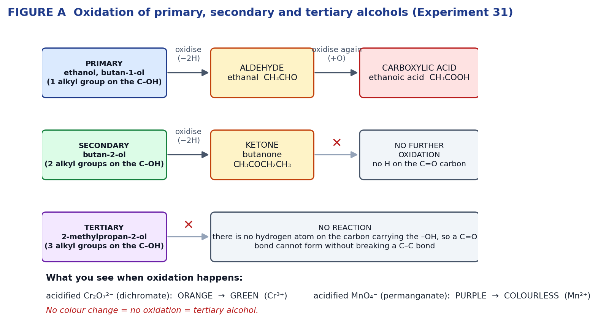
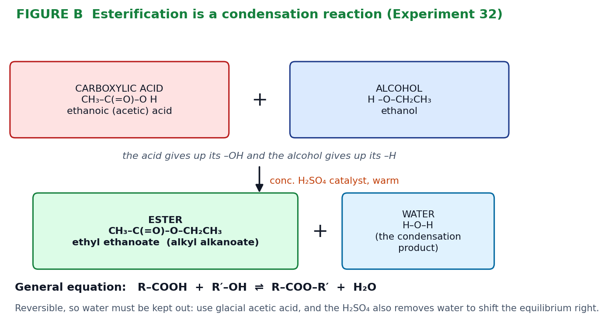

# Task 7 — Chemistry: Practical Validation, Reactions of Organic Molecules (Exp 31 & 32)

**Source material:** `Experiment 31.pdf` (*Exploring Chemistry Year 12*, pp. 92–94, "Reactivity of alcohols") and `Exp 32 - Esters.pdf` (pp. 95–96, "Esters"), both from the **Organic materials** chapter.

> **Where this sits in the course:** the ATCHE 2026 outline lists **Task 7 (Science Inquiry): Practical (Laboratory) Validation Exercises — Reactions of Organic Molecules**, under **test conditions**, at **Week 22 (Term 3, Week 2)**. That week’s content is the combustion and oxidation of alcohols, esterification, and the physical properties of organic compounds — exactly what Experiments 31 and 32 cover, so this guide is the preparation for that validation. The separate topic test, **Task 8: Test 4 Organic Molecules** (Week 23), is covered by `Task8_Test4_Organic_Molecules_Guide.md`, which works from Pearson 13.1–13.6 and 14.1–14.3.

---

## 1. The chemistry you need first — alcohols

**Functional group:** the **hydroxyl group, –OH**. General formula for a simple alcohol: `R–OH`. The –OH makes alcohols **polar** and able to **hydrogen bond**, which is why short-chain alcohols are water-soluble and have much higher boiling points than the corresponding alkanes. As the carbon chain lengthens the molecule becomes more non-polar, so **water solubility falls** (ethanol is fully miscible; octan-1-ol is essentially insoluble).

### Classification — count the alkyl groups on the carbon carrying the –OH

| Class | Alkyl groups on the C–OH carbon | H atoms on that carbon | Example in this prac | Structure |
|---|---|---|---|---|
| **Primary (1°)** | 1 | 2 | ethanol | CH₃CH₂OH |
| **Primary (1°)** | 1 | 2 | butan-1-ol | CH₃CH₂CH₂CH₂OH |
| **Secondary (2°)** | 2 | 1 | butan-2-ol | CH₃CH₂CH(OH)CH₃ |
| **Tertiary (3°)** | 3 | 0 | 2-methylpropan-2-ol | (CH₃)₃COH |

**The whole experiment hangs on that last column.** Oxidation of an alcohol means forming a **C=O** bond, which requires removing a hydrogen **from the carbon that carries the –OH**. A tertiary alcohol has none, so it cannot be oxidised without breaking a C–C bond — which these reagents cannot do.

### Oxidation products and what you see



| Oxidising agent | Colour change | Species responsible |
|---|---|---|
| Acidified **dichromate**, Cr₂O₇²⁻/H⁺ | **orange → green** | orange Cr₂O₇²⁻ reduced to green Cr³⁺ |
| Acidified **permanganate**, MnO₄⁻/H⁺ | **purple → colourless** | purple MnO₄⁻ reduced to almost colourless Mn²⁺ |

Always quote the colour change **and** the ion responsible — that's where the marks are.

### The half equations you must be able to write

**Reduction (the oxidising agents):**

```
Cr₂O₇²⁻ + 14H⁺ + 6e⁻  →  2Cr³⁺ + 7H₂O
MnO₄⁻   +  8H⁺ + 5e⁻  →   Mn²⁺  + 4H₂O
```

**Oxidation (the alcohols):**

```
1° → aldehyde:            RCH₂OH        →  RCHO   + 2H⁺ + 2e⁻
aldehyde → acid:          RCHO  + H₂O   →  RCOOH  + 2H⁺ + 2e⁻
1° → acid (overall):      RCH₂OH + H₂O  →  RCOOH  + 4H⁺ + 4e⁻
2° → ketone:              R₂CHOH        →  R₂C=O  + 2H⁺ + 2e⁻
3° :                      no reaction
```

### Reaction with sodium

Alcohols behave as **very weak acids** — sodium displaces the hydrogen of the –OH, giving hydrogen gas and a **sodium alkoxide**:

```
General:   2R–OH + 2Na  →  2R–ONa + H₂
Ethanol:   2CH₃CH₂OH + 2Na  →  2CH₃CH₂ONa + H₂
```

This is the same reaction sodium has with water, but **much less vigorous** — you see steady bubbling and the metal slowly disappearing rather than a violent reaction. Rate falls **1° > 2° > 3°** because the increasing number of electron-donating alkyl groups reduces the polarity of the O–H bond, and the bulky groups sterically hinder the sodium surface.

---

## 2. Experiment 31 — Reactivity of alcohols

**Aim:** to compare the reactivity of ethanol and the three isomeric C₄H₉OH alcohols (butan-1-ol, butan-2-ol, 2-methylpropan-2-ol) with acidified dichromate, acidified permanganate and (optionally) sodium metal, and to relate the differences to whether the alcohol is primary, secondary or tertiary.

**Hypothesis (if you're asked for one):** *If an alcohol is primary or secondary it will be oxidised by acidified dichromate and permanganate, producing a colour change, whereas a tertiary alcohol will not, because a tertiary alcohol has no hydrogen atom on the carbon bearing the hydroxyl group.*

### Variables

| Variable | Detail |
|---|---|
| **Independent** | the alcohol used — specifically its class (1°, 2°, 3°) |
| **Dependent** | evidence and relative rate of reaction: colour change of the oxidant; rate of gas evolution with sodium; odour of the product |
| **Controlled** | volume of alcohol (2 mL), volume of oxidant (1 mL acidified Na₂Cr₂O₇; 3–5 drops acidified KMnO₄), concentrations (0.1 mol L⁻¹ Na₂Cr₂O₇, 0.01 mol L⁻¹ KMnO₄, 6 mol L⁻¹ H₂SO₄), water-bath temperature (80 °C), heating time (~5 min), identical test tubes, size of sodium piece (rice-grain) |

### Method in brief

**Part A — dichromate:** heat 100 mL of hot tap water to 80 °C in a 250 mL beaker, then **turn the Bunsen off**. Put 2 mL of each alcohol into four labelled tubes. Mix 4 mL of 0.1 mol L⁻¹ Na₂Cr₂O₇ with 2 mL of 6 mol L⁻¹ H₂SO₄, add 1 mL of this to each alcohol, and heat in the bath ~5 min, shaking occasionally if the layers don't mix. Record colour changes, relative rates and (cautiously) odours.

**Part A — permanganate:** 2 mL of each alcohol in four fresh tubes; mix 2 mL KMnO₄ with 1 mL of 6 mol L⁻¹ H₂SO₄; add 3–5 drops to each and shake gently. Record.

**Part B (optional) — sodium:** 2 mL of each alcohol in four **dry** tubes; add one freshly cut rice-grain piece of sodium to each; compare rates. Dispose of residues in the teacher's beaker.

### Risk assessment

| Hazard | Risk | Control |
|---|---|---|
| Ethanol, butan-1-ol, butan-2-ol, 2-methylpropan-2-ol | **Highly flammable** | Turn your own **and all nearby** Bunsens off before handling; heat only in a pre-heated water bath, never over a flame |
| 6 mol L⁻¹ H₂SO₄ | Corrosive — skin/eye burns | Safety glasses; wash immediately with plenty of water; report spills |
| Sodium dichromate (Cr(VI)) | Toxic, carcinogenic, oxidising | Avoid skin contact, gloves, no mouth pipetting, dispose into labelled heavy-metal waste — never down the sink |
| Potassium permanganate | Strong oxidiser, stains skin/clothing | Handle with dropper, avoid contact with excess organics |
| Sodium metal | Reacts vigorously with water; produces flammable H₂ | Tweezers/spatula only, rice-grain pieces, **dry** tubes, no water nearby, quench residues in the teacher's beaker |
| Hot water bath (80 °C) | Scalds | Metal tongs to move tubes; keep the beaker at the back of the bench |
| Smelling products | Irritant/toxic vapours | Waft gently towards the nose; never inhale directly over the tube |

### Expected results

| Alcohol | Class | Acidified Cr₂O₇²⁻ | Acidified MnO₄⁻ | Product(s) | Odour |
|---|---|---|---|---|---|
| ethanol | 1° | orange → **green**, fairly fast on warming | purple → **colourless/pale brown** | ethanal, then ethanoic acid | sharp, vinegary (fruity if the aldehyde dominates) |
| butan-1-ol | 1° | orange → **green** | purple → **colourless** | butanal, then butanoic acid | rancid butter / sweaty |
| butan-2-ol | 2° | orange → **green** | purple → **colourless** | butanone only | sweet, solvent-like |
| 2-methylpropan-2-ol | 3° | **no change** (stays orange) | **no change** (stays purple) | none | unchanged alcohol |
| **Sodium (Part B)** | — | rate: **ethanol > butan-1-ol > butan-2-ol > 2-methylpropan-2-ol** | — | R–ONa + H₂ | — |

---

## 3. Experiment 31 — worked answers

**1. Which alcohols were oxidised by acidified Cr₂O₇²⁻ and acidified MnO₄⁻?**
**Ethanol, butan-1-ol and butan-2-ol** were all oxidised — each gave the colour change (orange → green with dichromate; purple → colourless with permanganate). **2-methylpropan-2-ol was not oxidised** by either reagent: the solutions stayed orange and purple respectively, because as a tertiary alcohol it has no hydrogen on the carbon bearing the –OH group.

**2. Formulas of the products of oxidation**

| Alcohol | Class | Aldehyde/ketone | Final product |
|---|---|---|---|
| ethanol, CH₃CH₂OH | 1° | ethanal, CH₃CHO | ethanoic acid, CH₃COOH |
| butan-1-ol, CH₃CH₂CH₂CH₂OH | 1° | butanal, CH₃CH₂CH₂CHO | butanoic acid, CH₃CH₂CH₂COOH |
| butan-2-ol, CH₃CH₂CH(OH)CH₃ | 2° | — | butanone, CH₃CH₂COCH₃ |
| 2-methylpropan-2-ol, (CH₃)₃COH | 3° | — | **no product** |

**3. Half equations and total equations for the oxidation of ethanol**

*Oxidation half equations:*
```
to the aldehyde:   CH₃CH₂OH        →  CH₃CHO  + 2H⁺ + 2e⁻
to the acid:       CH₃CH₂OH + H₂O  →  CH₃COOH + 4H⁺ + 4e⁻
```

*With acidified dichromate* (multiply to balance electrons — 12e⁻ for the acid, 6e⁻ for the aldehyde):
```
to ethanoic acid:  3CH₃CH₂OH + 2Cr₂O₇²⁻ + 16H⁺  →  3CH₃COOH + 4Cr³⁺ + 11H₂O
to ethanal:        3CH₃CH₂OH +  Cr₂O₇²⁻ +  8H⁺  →  3CH₃CHO  + 2Cr³⁺ +  7H₂O
```

*With acidified permanganate* (20e⁻ and 10e⁻ respectively):
```
to ethanoic acid:  5CH₃CH₂OH + 4MnO₄⁻ + 12H⁺  →  5CH₃COOH + 4Mn²⁺ + 11H₂O
to ethanal:        5CH₃CH₂OH + 2MnO₄⁻ +  6H⁺  →  5CH₃CHO  + 2Mn²⁺ +  8H₂O
```

**4. Half equations and total equations for primary, secondary and tertiary alcohols**

*Primary — butan-1-ol → butanoic acid* (4e⁻ transferred):
```
half:        CH₃CH₂CH₂CH₂OH + H₂O  →  CH₃CH₂CH₂COOH + 4H⁺ + 4e⁻
dichromate:  3CH₃CH₂CH₂CH₂OH + 2Cr₂O₇²⁻ + 16H⁺  →  3CH₃CH₂CH₂COOH + 4Cr³⁺ + 11H₂O
permanganate: 5CH₃CH₂CH₂CH₂OH + 4MnO₄⁻ + 12H⁺  →  5CH₃CH₂CH₂COOH + 4Mn²⁺ + 11H₂O
```

*Secondary — butan-2-ol → butanone* (2e⁻ transferred):
```
half:        CH₃CH₂CH(OH)CH₃  →  CH₃CH₂COCH₃ + 2H⁺ + 2e⁻
dichromate:  3CH₃CH₂CH(OH)CH₃ + Cr₂O₇²⁻ + 8H⁺  →  3CH₃CH₂COCH₃ + 2Cr³⁺ + 7H₂O
permanganate: 5CH₃CH₂CH(OH)CH₃ + 2MnO₄⁻ + 6H⁺  →  5CH₃CH₂COCH₃ + 2Mn²⁺ + 8H₂O
```

*Tertiary — 2-methylpropan-2-ol:* **no reaction**, so no half equation and no total equation can be written. State the reason: no hydrogen atom on the carbon attached to the –OH group, so a C=O bond cannot form.

**5. Observed order of reactivity of the C₄H₉OH isomers with sodium**
**butan-1-ol (1°) > butan-2-ol (2°) > 2-methylpropan-2-ol (3°)** — fastest bubbling and quickest disappearance of the metal for the primary alcohol, slowest for the tertiary. (Ethanol, being the smallest, reacts faster still.) The trend arises because additional alkyl groups are electron-donating, which reduces the polarity of the O–H bond and so reduces the ease with which the hydrogen is displaced, and because bulky groups sterically hinder access to the sodium surface.

**6. General equation for sodium with alcohols**
```
2R–OH + 2Na  →  2R–ONa + H₂
```
(sodium alkoxide + hydrogen gas)

**7. Half equations and total equation for sodium with alcohols**
```
oxidation:  Na  →  Na⁺ + e⁻
reduction:  2R–OH + 2e⁻  →  2R–O⁻ + H₂
total:      2R–OH + 2Na  →  2R–ONa + H₂
e.g.        2CH₃CH₂OH + 2Na  →  2CH₃CH₂ONa + H₂
```
Sodium is oxidised (0 → +1) and the hydrogen of the hydroxyl group is reduced (+1 → 0), so this is a redox reaction — which is why sodium is described as the reducing agent.

**8. The fourth C₄H₉OH isomer**
**2-methylpropan-1-ol**, a **primary** alcohol:

```
        CH₃
         |
   CH₃ – CH – CH₂ – OH          condensed:  (CH₃)₂CHCH₂OH
```

Predictions:

- **(a) With acidified Na₂Cr₂O₇:** it **will** be oxidised — orange to green — because it is primary and has two hydrogens on the carbon bearing the –OH. Products: **2-methylpropanal**, (CH₃)₂CHCHO, oxidised further to **2-methylpropanoic acid**, (CH₃)₂CHCOOH.
  ```
  3(CH₃)₂CHCH₂OH + 2Cr₂O₇²⁻ + 16H⁺  →  3(CH₃)₂CHCOOH + 4Cr³⁺ + 11H₂O
  ```

- **(b) With metallic sodium:** it **will** react, giving steady bubbles of H₂ and sodium 2-methylpropan-1-olate. As a primary alcohol its rate should be **similar to butan-1-ol** and clearly **faster than butan-2-ol or 2-methylpropan-2-ol**, though the branch adjacent to the –OH may slow it slightly compared with the straight-chain isomer.
  ```
  2(CH₃)₂CHCH₂OH + 2Na  →  2(CH₃)₂CHCH₂ONa + H₂
  ```

**9. Which alcohol would suit a commercial cleaning agent?**
**2-methylpropan-2-ol** (tert-butanol).

Justify it with the evidence from *this* experiment:

- The brief requires **low reactivity with common substances**. It was the **only** alcohol tested that showed **no reaction with acidified dichromate or acidified permanganate** — both solutions retained their original colour, so it resists oxidation, unlike the three others which were all oxidised.
- In Part B it reacted **most slowly with sodium**, again the least reactive of the four.
- It still meets the other criteria: the –OH group makes it **polar and able to hydrogen bond to water**, and with only four carbons it is **water soluble** (in fact fully miscible), so it will work as a polar solvent in an aqueous cleaning formulation.
- The three reactive alcohols would be oxidised in storage or in use — for example ethanol and butan-1-ol would form carboxylic acids, which would make the product acidic, smell unpleasant and potentially corrode packaging.

*A complete answer also acknowledges limits:* the tests only covered two oxidising agents and sodium, so further testing (stability in acid and base, with bleach, over time, at elevated temperature, and its flammability and toxicity) would be needed before recommending it commercially.

---

## 4. The chemistry you need — esters

**Esterification** is the reaction of a **carboxylic acid** with an **alcohol**, catalysed by concentrated sulfuric acid, forming an **ester** and **water**. Because a small molecule (water) is eliminated as two molecules join, it is a **condensation** reaction, and it is **reversible**.



```
R–COOH  +  R′–OH   ⇌   R–COO–R′  +  H₂O
```

The acid loses its **–OH** and the alcohol loses its **–H**; those fragments form the water.

### Naming esters — the trap that costs marks

The name has two words: **alkyl** (from the **alcohol**) then **alkanoate** (from the **acid**).

- ethanoic acid + **ethanol** → **ethyl** ethanoate
- **butanoic acid** + ethanol → ethyl **butanoate**
- ethanoic acid + **butan-1-ol** → **butyl** ethanoate

So *ethyl butanoate* and *butyl ethanoate* are made from **opposite** pairs of reagents. Read the name backwards to find the acid.

### Physical properties that matter in this prac

- Esters are **less dense than water** and **insoluble/immiscible** in it (no O–H, so no hydrogen bonding to water) — hence the ester floats as a distinct layer when poured into water.
- Esters are **volatile with strong, pleasant, fruity odours** — that's the whole basis of identification here.
- The reactants are the opposite: carboxylic acids and short alcohols **are** water soluble and hydrogen bond, and acetic acid smells sharply of vinegar.

---

## 5. Experiment 32 — Esters

**Aim:** to prepare a range of esters by reacting alcohols with acetic acid (and salicylic acid with methanol) using concentrated sulfuric acid as catalyst, and to identify them by their odours.

### The six tubes

| Tube | Alcohol | Acid | Ester formed | Systematic name | Typical odour / where you've met it |
|---|---|---|---|---|---|
| **A** | ethanol (2 mL) | acetic (2 mL) | CH₃COOCH₂CH₃ | **ethyl ethanoate** | solvent, "pear drops" — nail polish remover |
| **B** | butan-1-ol (2 mL) | acetic (2 mL) | CH₃COO(CH₂)₃CH₃ | **butyl ethanoate** | pineapple |
| **C** | pentan-1-ol (2 mL) | acetic (2 mL) | CH₃COO(CH₂)₄CH₃ | **pentyl ethanoate** | banana / pear |
| **D** | octan-1-ol (2 mL) | acetic (2 mL) | CH₃COO(CH₂)₇CH₃ | **octyl ethanoate** | orange |
| **E** | 3-methylbutan-1-ol (2 mL) | acetic (2 mL) | CH₃COOCH₂CH₂CH(CH₃)₂ | **3-methylbutyl ethanoate** (isoamyl acetate) | banana — banana lollies, pear drops |
| **F** | methanol (2–3 mL) | salicylic acid (~1 cm of crystals) | HOC₆H₄COOCH₃ | **methyl salicylate** (methyl 2-hydroxybenzoate) | wintergreen — Deep Heat / muscle rub, some mouthwash |

Each tube also gets **5 drops of concentrated H₂SO₄**.

### Method in brief

Load the six tubes, stopper them and set aside. Boil ~400 mL of tap water in a 1 L beaker, **turn the Bunsen off**, unstopper the tubes and stand them in the bath for **15 minutes**. Then pour each tube, one at a time, into a 100 mL beaker holding ~10 mL of fresh tap water, and cautiously waft the odour of the ester floating on the surface. Use fresh water for every tube.

### Risk assessment

| Hazard | Risk | Control |
|---|---|---|
| **Concentrated H₂SO₄** | Very corrosive, dehydrating, exothermic with water | Dispense by dropper only, safety glasses, add to the mixture last, wash any splash with large volumes of water immediately |
| **Glacial acetic acid** | Corrosive; pungent, irritating vapour | Safety glasses, dispense in a fume cupboard or well-ventilated area, keep stoppered |
| **Methanol** | Toxic (ingestion/absorption — can cause blindness), highly flammable | Gloves, no naked flames, never taste, wash hands after |
| Alcohols and esters generally | Flammable | **Bunsen off before heating**; use the pre-boiled water bath as the heat source, never a direct flame |
| Salicylic acid | Irritant to skin/eyes | Avoid dust, wash hands |
| Smelling the products | Vapour irritation | Waft gently; never put your nose over the tube mouth |
| Hot water bath | Scalds | Tongs, stable beaker position |

---

## 6. Experiment 32 — worked answers

**1. Equations for the formation of the esters made**

```
A  CH₃COOH + CH₃CH₂OH            ⇌  CH₃COOCH₂CH₃          + H₂O
B  CH₃COOH + CH₃(CH₂)₃OH          ⇌  CH₃COO(CH₂)₃CH₃        + H₂O
C  CH₃COOH + CH₃(CH₂)₄OH          ⇌  CH₃COO(CH₂)₄CH₃        + H₂O
D  CH₃COOH + CH₃(CH₂)₇OH          ⇌  CH₃COO(CH₂)₇CH₃        + H₂O
E  CH₃COOH + (CH₃)₂CHCH₂CH₂OH     ⇌  CH₃COOCH₂CH₂CH(CH₃)₂   + H₂O
F  HOC₆H₄COOH + CH₃OH             ⇌  HOC₆H₄COOCH₃           + H₂O
```
Each is catalysed by concentrated H₂SO₄ and each produces water. Use ⇌ — the reaction is reversible.

**2. General equation for esterification**
```
R–COOH + R′–OH  ⇌  R–COO–R′ + H₂O          (conc. H₂SO₄ catalyst, warmed)
```
carboxylic acid + alcohol ⇌ ester + water.

**3. Names of the esters produced**
A **ethyl ethanoate**; B **butyl ethanoate**; C **pentyl ethanoate**; D **octyl ethanoate**; E **3-methylbutyl ethanoate** (isoamyl acetate); F **methyl salicylate** (systematically, methyl 2-hydroxybenzoate).

**4. Where you have met these odours before**
Ethyl ethanoate — nail polish remover and general solvent/glues. Butyl ethanoate — pineapple flavouring/fragrance. Pentyl ethanoate and 3-methylbutyl ethanoate — banana and pear-drop lollies, artificial banana flavouring. Octyl ethanoate — orange-scented products. Methyl salicylate — wintergreen, in liniments such as Deep Heat, some mouthwashes and chewing gum.

**5. Role of the sulfuric acid**
It acts in **two** ways, and a full-mark answer gives both:

- As a **catalyst** — it protonates the carbonyl oxygen of the carboxylic acid, making the carbonyl carbon more susceptible to attack by the alcohol, which **speeds the reaction up**. It is not consumed.
- As a **dehydrating agent** — by absorbing the water produced it shifts the position of this reversible equilibrium to the **right** (Le Châtelier's principle), **increasing the yield** of ester.

**6. Starting materials for three named esters**

| Ester | Carboxylic acid | Alcohol |
|---|---|---|
| **ethyl butanoate** | butanoic acid, CH₃CH₂CH₂COOH | ethanol, CH₃CH₂OH |
| **butyl ethanoate** | ethanoic (acetic) acid, CH₃COOH | butan-1-ol, CH₃CH₂CH₂CH₂OH |
| **methyl benzoate** | benzoic acid, C₆H₅COOH | methanol, CH₃OH |

(Note how the first two use the *same two* fragments swapped over — that's the naming trap in §4.)

**7. Why glacial acetic acid rather than an acetic acid solution?**
Because **water is a product** of the reaction. Esterification is reversible, so adding an aqueous solution introduces water on the product side and, by Le Châtelier's principle, shifts the equilibrium **back towards the reactants**, lowering the yield of ester. A solution would also **dilute the reactants**, reducing the collision frequency and therefore the rate. Glacial (pure, ~17 mol L⁻¹) acetic acid keeps the water content minimal and the concentration of reactant maximal.

**8. Why pour the mixture into a beaker of water?**
Three reasons:

- The **unreacted acetic acid, the alcohol and the sulfuric acid catalyst are all water soluble**, so they dissolve away, whereas the ester is not. This removes the sharp vinegary smell of acetic acid that would otherwise **mask** the ester's odour.
- The ester is **insoluble in water and less dense than it**, so it collects as a thin layer floating on the surface where it can be seen and safely smelled.
- Diluting the corrosive concentrated sulfuric acid makes it **safer** to bring the beaker near your face. (Dilute sodium carbonate would be better still, since it neutralises the acids — you would see effervescence of CO₂.)

---

## 7. Bonus: the quantitative question they often bolt on

If you are asked for a **theoretical or percentage yield** for tube A (ethyl ethanoate from 2.00 mL ethanol + 2.00 mL glacial acetic acid):

| Step | Working |
|---|---|
| mass of ethanol | 2.00 mL × 0.789 g mL⁻¹ = 1.578 g |
| n(ethanol) | 1.578 ÷ 46.07 g mol⁻¹ = **0.03425 mol** |
| mass of acetic acid | 2.00 mL × 1.049 g mL⁻¹ = 2.098 g |
| n(acetic acid) | 2.098 ÷ 60.05 g mol⁻¹ = **0.03494 mol** |
| limiting reagent | 1 : 1 stoichiometry, so **ethanol** (fewer mol) |
| theoretical n(ester) | 0.03425 mol |
| theoretical mass | 0.03425 × 88.11 g mol⁻¹ = **3.02 g** |
| if 1.80 g is isolated | % yield = 1.80 ÷ 3.02 × 100 = **59.6 %** |

**Why the yield is always well below 100 %:** the reaction reaches **equilibrium** rather than going to completion (K<sub>c</sub> ≈ 4 for this system, so an appreciable amount of acid and alcohol remain); the ester is **volatile** and some is lost as vapour from an open tube in a boiling water bath; some ester is lost when the mixture is poured into water and washed; and concentrated H₂SO₄ causes **side reactions**, dehydrating the alcohol to an alkene or an ether.

---

## 8. Investigation skills — what an "investigation" mark scheme wants

**Validity** — only the independent variable changes. Here that means identical volumes, concentrations, temperature and heating time for every alcohol, so any difference in reaction is attributable to the alcohol's structure alone. Using the same batch of oxidant mixture for all four tubes is a validity control.

**Reliability** — repeat each test (at least three trials) and compare with other groups' results; a single test tube of each is not enough to be confident.

**Accuracy** — measure the 2 mL volumes with a graduated cylinder rather than by eye, use a thermometer to confirm 80 °C, cut sodium pieces to the same size, and time the heating with a stopwatch.

**Sources of error and how to reduce them**

| Source of error | Effect | Improvement |
|---|---|---|
| Judging "rate" of colour change by eye | Subjective, no numerical data | Time to a fixed colour endpoint with a stopwatch, or use a colorimeter/UV-vis to follow the loss of Cr₂O₇²⁻ or MnO₄⁻ |
| Identifying products by smell | Unreliable, and different people describe odours differently | Confirm by boiling point, or by testing the acidity of the product (a carboxylic acid will effervesce with sodium carbonate); a ketone will not |
| Sodium pieces of unequal size | Different surface area changes the rate, confounding the comparison | Cut pieces of equal mass and record the mass |
| Alcohols and esters are volatile | Reactant/product lost as vapour, weakening the observed reaction | Stopper between steps; keep the bath below boiling; use a reflux condenser for quantitative work |
| Immiscible layers not mixing | Reaction slower than it should be, may look like "no reaction" | Shake regularly, as the method says — important for the C₄ alcohols |
| Water in the "dry" tubes (Part B) | Sodium reacts with the water instead, exaggerating the rate | Dry tubes thoroughly; run a water-free control |
| Concentrated H₂SO₄ added by "5 drops" | Drop size varies, so catalyst amount varies between tubes | Same dropper for every tube, or measure by volume |

**A control you can mention:** repeating a tube with **no oxidising agent** (or with water in place of the acidified dichromate) shows that any colour change or smell really is caused by the reaction and not by the heating alone.

---

## 9. Exam technique and the traps in this topic

- **Quote colour changes with the species:** "orange Cr₂O₇²⁻ → green Cr³⁺", not just "it goes green".
- **Balance half equations properly:** balance atoms other than O and H first, then add H₂O for oxygen, then H⁺ for hydrogen, then electrons for charge. Check charge on both sides at the end — the commonest lost mark.
- **Naming esters:** alkyl from the alcohol comes first, alkanoate from the acid second. Check by reading the name backwards.
- **"No reaction" still needs a reason:** a tertiary alcohol has no hydrogen on the carbon bearing the –OH group, so the C=O cannot form.
- **Identifying an unknown alcohol:** add acidified dichromate and warm. No colour change → **tertiary**. If it goes green, distinguish **primary from secondary** by the product: a primary alcohol ends up as a carboxylic acid, which will turn moist blue litmus red and effervesce with Na₂CO₃; a secondary alcohol gives a ketone, which will not.
- **Say "reversible"** whenever esterification comes up, and use ⇌. Then Le Châtelier explains the glacial acetic acid, the role of H₂SO₄ as a dehydrator, and why yields are modest.
- **Link structure to property** whenever you can: no O–H in an ester → no hydrogen bonding to water → insoluble, floats, volatile, strong smell.

---

## 10. Checklist

- [ ] Classify any alcohol as 1°, 2° or 3° by counting alkyl groups on the carbon bearing the –OH
- [ ] State the colour changes for acidified dichromate and permanganate, with the ions responsible
- [ ] Write the two reduction half equations from memory (Cr₂O₇²⁻/6e⁻ and MnO₄⁻/5e⁻)
- [ ] Write oxidation half equations for 1° → aldehyde, aldehyde → acid, 1° → acid, 2° → ketone
- [ ] Combine them into balanced total equations and check atoms **and** charge
- [ ] Explain why tertiary alcohols are not oxidised
- [ ] Write the sodium reaction as a general equation, as half equations, and identify what is oxidised/reduced
- [ ] Draw and name the fourth C₄H₉OH isomer and predict both of its reactions
- [ ] Answer the solvent-selection question using evidence, and state the limitations of the evidence
- [ ] Write esterification equations for all six tubes, with ⇌
- [ ] Name every ester correctly (alkyl first, from the alcohol)
- [ ] Give **both** roles of concentrated H₂SO₄
- [ ] Explain the glacial acetic acid and the pour-into-water steps using Le Châtelier and solubility/density
- [ ] Do a limiting-reagent and percentage-yield calculation, and give three reasons yield is below 100 %
- [ ] Write a risk assessment: hazard, risk, control — for H₂SO₄, glacial acetic acid, methanol, sodium, dichromate, flammable alcohols
- [ ] State independent, dependent and controlled variables, and distinguish validity, reliability and accuracy

---

### Note on the other files in this repo

The chemistry course outline is `KSSHS ATCHE Course Outline 2026.docx` and the textbook is `Pearson - Chemistry - Year 12 Unit 4.pdf`. The `hp12wa8e_11_*.pdf`, `KSSHS_Course_Outline_(1)_ATHBY_2026_v2.docx` and `Task6_*` files are **Human Biology**. The `html` file is an unrelated web page.
