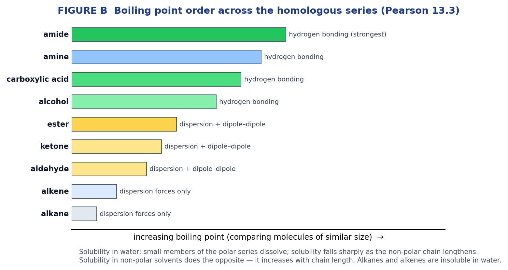
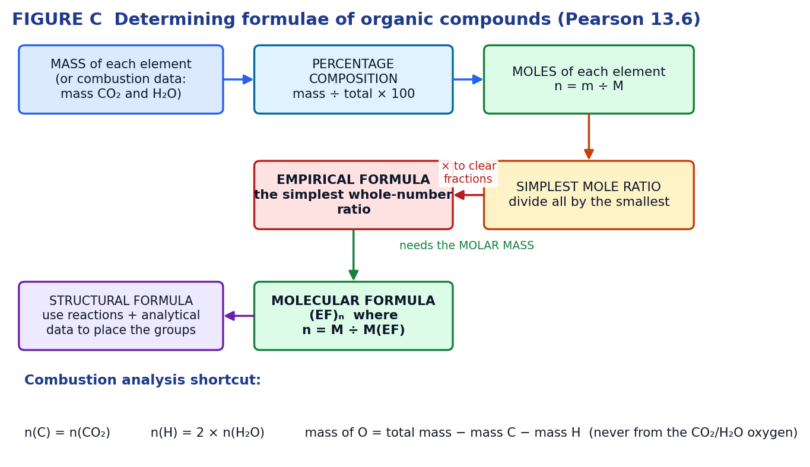
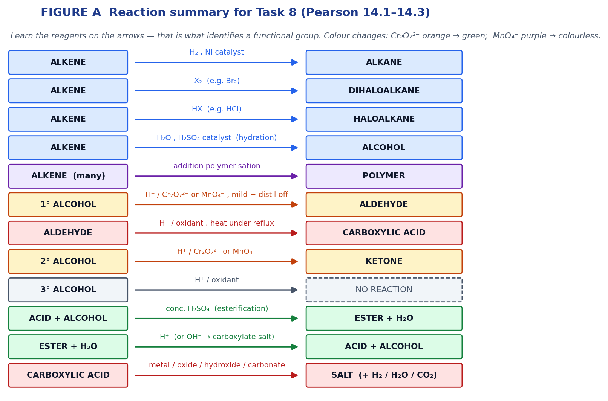

# Task 8 — Chemistry: Test 4, Organic Molecules

**Course:** ATAR Chemistry Year 12 (ATCHE), Kent Street SHS, 2026
**Sources:** `KSSHS ATCHE Course Outline 2026.docx` (Weeks 18–23) and `Pearson - Chemistry - Year 12 Unit 4.pdf` (Chapter 13 *Structure of organic molecules*, Chapter 14 *Reactions of organic molecules*)

---

## 1. What the outline says about Task 8

| Field | Detail |
|---|---|
| Task | **Task 8: Test 4 — Organic Molecules** |
| When | **Week 23 (Term 3, Week 3)** |
| Immediate content | **Pearson 13.6**; Lucarelli Ch 13 pp. 140–142, Set 19 pp. 142–144 |

The test comes at the end of the Organic Molecules sequence, so it covers everything taught in **Weeks 18–23**. Here is exactly what the Resources column lists for each of those weeks:

| Weeks | Syllabus content | Pearson | Lucarelli |
|---|---|---|---|
| **18–19** (T2 W9–10) | hydrocarbon skeletons and functional groups (alkenes, alcohols, aldehydes, ketones, carboxylic acids, esters, amines, amides); structural formulae, condensed or showing bonds | **13.1–13.5** and **14.1–14.3** | Ch 10 pp. 108–113 (Set 15 pp. 113–117); Ch 11 pp. 118–127 (Set 16 pp. 128–131) |
| **20–21** (T2 W11, T3 W1) | characteristic reactions used to identify functional groups — addition reactions of alkenes, redox reactions of alcohols, acid–base reactions of carboxylic acids; IUPAC nomenclature up to 8 carbons with simple branching and one functional group; chain, position and cis-trans isomerism | (13.5, 14.1–14.3) | Ch 12 pp. 132–133 (Set 17 pp. 133–135) |
| **22** (T3 W2) | complete combustion of alcohols; oxidation with acidified MnO₄⁻ or Cr₂O₇²⁻ (1° → aldehyde → carboxylic acid, 2° → ketone) with characteristic observations and equations; condensation of alcohols with carboxylic acids to form esters; physical properties (boiling point, solubility in water and organic solvents) explained by dispersion forces, dipole–dipole interactions and hydrogen bonds | (14.2, 14.3, 13.3) | Ch 12 pp. 135–137 (Set 18 pp. 138–139) |
| **23** (T3 W3) | empirical and molecular formulae determined by calculation, and structure established from the chemical reactions the compound undergoes plus other analytical data | **13.6** | Ch 13 pp. 140–142 (Set 19 pp. 142–144) |

**So the examinable scope is Pearson 13.1 → 13.6 and 14.1 → 14.3.** (Pearson 14.4 organic synthesis, and chapters 15–18 on polymers, soaps, proteins and enzymes, belong to Task 9 and later.)

> **Two notes on the source material.** The **Lucarelli** workbook is not in the repo, so page references to it are carried over from the outline but its questions aren't reproduced here. The **Pearson** PDF is a scan with no text layer, so it was read by OCR — section numbering and the summary points below are taken from the book itself. Separately, `Experiment 31.pdf` and `Exp 32 - Esters.pdf` belong to **Task 7** (Week 22 Practical Validation — Reactions of Organic Molecules), not this test; there's a companion guide for those in the repo.

---

## 2. Pearson 13.1 — Diversity of carbon compounds

Carbon forms more compounds than all other elements combined because it has **four valence electrons** (so it forms four strong covalent bonds), it bonds readily to itself in chains, branches and rings, and it forms stable multiple bonds.

**Homologous series** — a family in which each member has one more **–CH₂–** unit than the last. Members share a **general formula**, similar chemical properties, and show a gradual trend in physical properties.

| Series | General formula | Bonding | Saturated? |
|---|---|---|---|
| **Alkanes** | **CₙH₂ₙ₊₂** | C–C single bonds only | saturated |
| **Alkenes** | **CₙH₂ₙ** | contains one C=C double bond | unsaturated |

**Representing molecules**

- **Molecular formula** — C₄H₁₀. Says what atoms, not how they're joined.
- **Structural formula** — every atom and bond drawn. Bonds are usually drawn at right angles for clarity, even though the real geometry around each carbon is **tetrahedral** (~109.5°), which is why carbon chains are actually zig-zagged, not straight.
- **Condensed structural formula** — CH₃CH₂CH₂CH₃, or CH₃CH(CH₃)CH₂CH₃ where branches sit in brackets.

**Naming an alkene (the flowchart in 13.1):** identify the longest unbranched carbon chain containing the C=C → number the chain so the **double bond gets the lowest possible number** → name and number any branches → check whether cis-trans isomerism exists and add the prefix if so. Example: CH₃CH=CHCH₂CH₃ is pent-2-ene.

---

## 3. Pearson 13.2 — Functional groups

A **functional group** is the group of atoms or bonds responsible for a molecule's characteristic chemical properties. Most organic compounds can be regarded as hydrocarbons in which one or more hydrogens has been replaced.

| Class | Functional group | Where it sits | Naming | Example (condensed) | Example name |
|---|---|---|---|---|---|
| Alkene | **C=C** | anywhere in the chain | suffix **-ene** + locant | CH₃CH=CH₂ | propene |
| Alcohol | **–OH** hydroxyl | anywhere | drop *-e*, add **-ol** + locant | CH₃CH₂OH | ethanol |
| Aldehyde | **–CHO** carbonyl at the end | **end only** | drop *-e*, add **-al** (no locant needed) | CH₃CHO | ethanal |
| Ketone | **–CO–** carbonyl within the chain | **not** the end | drop *-e*, add **-one** + locant | CH₃COCH₃ | propanone |
| Carboxylic acid | **–COOH** carboxyl | **end only** | add **-oic acid** | CH₃COOH | ethanoic acid |
| Ester | **–COO–** | within the chain | **two words**: alkyl (from the alcohol) + alkanoate (from the acid) | CH₃COOCH₂CH₃ | ethyl ethanoate |
| Amine (primary) | **–NH₂** amino | anywhere | drop *-e*, add **-amine** + locant | CH₃CH₂NH₂ | ethanamine |
| Amide (primary) | **–CONH₂** | **end only** | drop *-e*, add **-amide** | CH₃CONH₂ | ethanamide |

**The carbonyl group, C=O, is shared** by aldehydes, ketones, carboxylic acids, esters and amides — what distinguishes them is what else is attached to that carbon and **where in the chain it sits**.

**Why some groups can't have position isomers:** the carboxyl, aldehyde and amide groups can only occur at the **end** of a chain, because that carbon already uses a double bond to one oxygen plus its other bonds. So there is no "propan-2-oic acid". Alcohols, amines, ketones and esters *can* vary in position and therefore have **positional isomers**.

**Ester naming, worked:** for CH₃CH₂COOCH₃ — the part on the right of the –COO– came from the **alcohol** (CH₃– → methyl), the part on the left came from the **acid** (CH₃CH₂COOH, propanoic acid → propanoate). Name: **methyl propanoate**.

---

## 4. Pearson 13.3 — Physical properties



**Boiling point** is determined by intermolecular forces. Dispersion forces are **always** present; on top of those a molecule may have **dipole–dipole** attractions (polar C=O) or **hydrogen bonds** (O–H or N–H).

- Alkanes and alkenes are non-polar → **dispersion forces only** → lowest boiling points. Strength grows with molecular size and with a less-branched shape (more surface contact).
- Aldehydes, ketones and esters have a polar carbonyl but no O–H → **dispersion + dipole–dipole** → intermediate.
- Alcohols, carboxylic acids, amines and amides can **hydrogen bond** → highest.
- Comparing molecules of **similar size**, Pearson gives the order: **alkanes < alkenes < aldehydes < ketones < esters < alcohols < carboxylic acids < amines < amides**.

**Solubility in water** depends on whether water molecules can hydrogen bond to the solute, so it is a tug-of-war between the polar functional group and the non-polar hydrocarbon "tail":

- Alkanes and alkenes are **insoluble** in water; they *are* soluble in non-polar organic solvents.
- The **small** members of the alcohol, aldehyde, ketone, ester, amine and amide series are generally soluble in water, and solubility **falls rapidly as chain length increases**.
- Solubility in **non-polar** solvents does the opposite — it **increases** with chain length.

**Answer structure that scores:** name the forces present in each substance → compare their relative strength → link to the observation. e.g. *"Butan-1-ol can hydrogen bond through its –OH group, whereas butanal has only dipole–dipole attractions and dispersion forces between its molecules. More energy is required to separate the alcohol molecules, so butan-1-ol has the higher boiling point."*

---

## 5. Pearson 13.4 — Isomers

**Isomers** contain the same number and type of atoms arranged differently, so they have the **same molecular formula but different structures** — and therefore different properties.

| Type | What differs | Example |
|---|---|---|
| **Chain (skeletal) isomers** | the branching of the carbon skeleton | butane and 2-methylpropane (C₄H₁₀) |
| **Positional isomers** | the position of a functional group on the chain | butan-1-ol and butan-2-ol (C₄H₁₀O); pent-1-ene and pent-2-ene |
| **Geometric (cis-trans) isomers** | arrangement **in space**, atoms joined in the same order | cis- and trans-but-2-ene |

**cis-trans isomerism requires restricted rotation** — which occurs about a **C=C double bond** (or in a ring) — **and** two *different* groups attached to the carbon at **each** end of the double bond. If either double-bonded carbon carries two identical groups (e.g. two H atoms), there are **no** cis-trans isomers.

- **cis** — the two like/priority groups are on the **same** side of the double bond.
- **trans** — on **opposite** sides.

The shortest alkane with chain isomers is **butane** (C₄H₁₀ → 2 isomers).

---

## 6. Pearson 13.5 — IUPAC nomenclature

The naming algorithm, in order:

1. **Find the longest unbranched carbon chain** — that gives the parent name (meth-, eth-, prop-, but-, pent-, hex-, hept-, oct-). The chain may bend around corners in the drawing; count carefully.
2. **Identify the functional group(s)** and decide which is named as a **suffix** (the highest priority one) and which become **prefixes**.
3. **Number the chain** so the carbon attached to the **highest-priority functional group gets the lowest number**. (Where there's no functional group to fix it, number so the substituents get the lowest locants.)
4. **Insert the locant before each group**, use **di-, tri-, tetra-** multipliers for repeats, and list prefixes **alphabetically**.
5. Separate numbers from numbers with commas and numbers from letters with hyphens.

**Priority order for the suffix (highest first):** carboxylic acid > ester > amide > aldehyde > ketone > alcohol > amine > alkene. Lower-priority groups become prefixes (hydroxy-, amino-, oxo-, alkyl-).

**Fixing wrong names — the classic exam item**

| Given (wrong) | Why it's wrong | Correct |
|---|---|---|
| *3-aminopropane* | propane has only 3 carbons; numbering must give the amino group the **lowest** locant, and C3 from one end is C1 from the other. The group should also be the suffix. | **propan-1-amine** (1-aminopropane) |
| *3-ethyl-hydroxy-2-butane* | the hydroxyl has no locant and isn't expressed as the **-ol** suffix; and the parent chain chosen isn't the longest — including the ethyl branch gives a 5-carbon chain | **3-methylpentan-2-ol** |

---

## 7. Pearson 13.6 — Determining formulae (the Week 23 content)



**Percentage composition** of each element:

```
%element = (mass of the element present ÷ total mass of the compound) × 100
```

**Worked example 1 — percentage composition.** 8.38 g of a compound contains 5.44 g carbon, 1.13 g hydrogen and 1.81 g oxygen.

```
%C = 5.44 / 8.38 × 100 = 64.9 %
%H = 1.13 / 8.38 × 100 = 13.5 %
%O = 1.81 / 8.38 × 100 = 21.6 %          (check: they sum to 100 %)
```

**Worked example 2 — empirical formula from percentages.** A compound is 52.2 % carbon, 13.0 % hydrogen, remainder oxygen.

```
Assume 100 g, so the masses in grams equal the percentages. O = 100 − 52.2 − 13.0 = 34.8 %

n(C) = 52.2 / 12.01 = 4.346 mol
n(H) = 13.0 / 1.008 = 12.90 mol
n(O) = 34.8 / 16.00 = 2.175 mol

Divide through by the smallest (2.175):
C : H : O  =  1.998 : 5.93 : 1.000  ≈  2 : 6 : 1

Empirical formula = C₂H₆O
```

**Worked example 3 — molecular formula from empirical formula and molar mass.** A sample of 0.8390 mol has a mass of 152.7 g.

```
M = m / n = 152.7 / 0.8390 = 182.0 g mol⁻¹

If the empirical formula were CH₂O (M = 30.03):  n = 182.0 / 30.03 = 6.06  ✗ not a whole number
With the empirical formula C₃H₇O₃ (M = 91.09):   n = 182.0 / 91.09 = 2.00  ✓

Molecular formula = (C₃H₇O₃)₂ = C₆H₁₄O₆
```

*The check matters:* **n must come out as a whole number**. If it doesn't, either the empirical formula or the molar mass is wrong — say so in your answer.

**Worked example 4 — combustion analysis.** 0.500 g of a compound containing only C, H and O burns completely to give 0.955 g CO₂ and 0.587 g H₂O.

```
n(CO₂) = 0.955 / 44.01 = 0.02170 mol  →  n(C) = 0.02170 mol  →  m(C) = 0.02170 × 12.01 = 0.2606 g
n(H₂O) = 0.587 / 18.02 = 0.03258 mol  →  n(H) = 2 × 0.03258 = 0.06515 mol  →  m(H) = 0.0657 g

m(O) = 0.500 − 0.2606 − 0.0657 = 0.1737 g   →  n(O) = 0.1737 / 16.00 = 0.01086 mol

Divide by the smallest (0.01086):   C : H : O = 2.00 : 6.00 : 1.00

Empirical formula = C₂H₆O.  If M = 46.07 g mol⁻¹ then n = 1, so the molecular formula is also C₂H₆O.
```

**The trap:** get the oxygen by **subtracting** from the total sample mass. Never take it from the oxygen in the CO₂ or H₂O — that oxygen came from the O₂ used to burn the sample.

**Establishing the structure** (the second half of the Week 23 dot point): once you have the molecular formula, use the **reactions** the compound undergoes to place the functional group. C₂H₆O could be ethanol or methoxymethane; if it is oxidised by acidified dichromate to an acid, and reacts with sodium to give H₂, it is **ethanol**.

---

## 8. Pearson 14.1 — Reactions of alkenes

**Combustion** — alkenes burn in oxygen to give carbon dioxide and water:
`C₃H₆(g) + 4½O₂(g) → 3CO₂(g) + 3H₂O(g)`

**Addition reactions** — the C=C double bond opens and one new group joins each carbon, converting an unsaturated molecule into a **saturated** one:

| Reagent | Conditions | Product | Example |
|---|---|---|---|
| **H₂** | Ni (or Pt) catalyst | alkane | C₂H₄ + H₂ → C₂H₆ |
| **X₂** (Br₂, Cl₂) | room temperature | **di**haloalkane | C₂H₄ + Br₂ → CH₂BrCH₂Br (1,2-dibromoethane) |
| **HX** (HCl, HBr) | — | haloalkane | C₂H₄ + HCl → CH₃CH₂Cl (chloroethane) |
| **H₂O** | H₂SO₄ (or H₃PO₄) catalyst | **alcohol** (hydration) | C₂H₄ + H₂O → CH₃CH₂OH |

**Two possible products:** when the alkene is not symmetrical, the new groups can add either way round. But-1-ene + HCl gives both 1-chlorobutane and 2-chlorobutane. Show both, and note which forms in greater amount if your course requires it.

**Addition polymerisation** — alkenes add to each other, the double bonds opening to form long chains containing **only C–C single bonds**. Ethene → polyethene. The repeating unit has the same atoms as the monomer, so you can work backwards from a polymer's repeat unit to its monomer by putting the double bond back.

**Test for unsaturation:** bromine water is **decolourised** (orange → colourless) by an alkene, because Br₂ is consumed in an addition reaction. An alkane leaves it orange.

---

## 9. Pearson 14.2 — Reactions of alcohols

**Combustion** — all alcohols burn completely in excess oxygen to CO₂ and H₂O, strongly exothermically, which is why ethanol is used as a fuel (E10, methylated spirits, bioethanol from fermented sugar cane):
`C₂H₅OH(l) + 3O₂(g) → 2CO₂(g) + 3H₂O(g)`

**Oxidation** — with strong inorganic oxidising agents: acidified **dichromate** (K₂Cr₂O₇/H⁺) or acidified **permanganate** (KMnO₄/H⁺). What happens depends on the **class** of alcohol, which is why this is used as an identification test.

| Class | –OH is on a carbon bonded to | Product | Observation |
|---|---|---|---|
| **Primary (1°)** | 1 alkyl group | **aldehyde**, then on further heating the **carboxylic acid** | colour change occurs |
| **Secondary (2°)** | 2 alkyl groups | **ketone** (no further oxidation) | colour change occurs |
| **Tertiary (3°)** | 3 alkyl groups | **no reaction** | **no colour change** |

- **Dichromate:** orange Cr₂O₇²⁻ → green Cr³⁺.
- **Permanganate:** purple MnO₄⁻ → colourless Mn²⁺.
- To stop at the **aldehyde**, use milder conditions — lower temperature, shorter reaction time — and **distil the aldehyde off** as it forms (its boiling point is lower, since it can't hydrogen bond). To go all the way to the **carboxylic acid**, heat under **reflux** with excess oxidant.
- A tertiary alcohol resists oxidation because there is **no hydrogen on the carbon carrying the –OH**, so the C=O cannot form without breaking a C–C bond.

**Oxidation half equations**

```
1° → aldehyde:       RCH₂OH        →  RCHO   + 2H⁺ + 2e⁻
aldehyde → acid:     RCHO  + H₂O   →  RCOOH  + 2H⁺ + 2e⁻
1° → acid overall:   RCH₂OH + H₂O  →  RCOOH  + 4H⁺ + 4e⁻
2° → ketone:         R₂CHOH        →  R₂C=O  + 2H⁺ + 2e⁻

Cr₂O₇²⁻ + 14H⁺ + 6e⁻  →  2Cr³⁺ + 7H₂O
MnO₄⁻   +  8H⁺ + 5e⁻  →   Mn²⁺  + 4H₂O
```

**Worked redox equation A — propan-2-ol (2°) heated with acidified permanganate**

```
oxidation:  CH₃CH(OH)CH₃  →  CH₃COCH₃ + 2H⁺ + 2e⁻            (×5)
reduction:  MnO₄⁻ + 8H⁺ + 5e⁻  →  Mn²⁺ + 4H₂O                (×2)

overall:    5CH₃CH(OH)CH₃ + 2MnO₄⁻ + 6H⁺  →  5CH₃COCH₃ + 2Mn²⁺ + 8H₂O
observation: purple solution decolourises; the product is the ketone propanone
```

**Worked redox equation B — butan-1-ol (1°) heated with acidified dichromate**

```
oxidation:  CH₃CH₂CH₂CH₂OH + H₂O  →  CH₃CH₂CH₂COOH + 4H⁺ + 4e⁻   (×3)
reduction:  Cr₂O₇²⁻ + 14H⁺ + 6e⁻  →  2Cr³⁺ + 7H₂O                 (×2)

overall:    3CH₃CH₂CH₂CH₂OH + 2Cr₂O₇²⁻ + 16H⁺  →  3CH₃CH₂CH₂COOH + 4Cr³⁺ + 11H₂O
observation: orange solution turns green; the product is butanoic acid
```

*Always check charge as well as atoms.* In equation B: left −4 + 16 = +12; right 4 × (+3) = +12. ✓

---

## 10. Pearson 14.3 — Reactions of carboxylic acids

**They are weak acids** — only partially ionised in water, so the equilibrium lies to the left:

```
CH₃CH₂CH₂COOH(aq) + H₂O(l)  ⇌  CH₃CH₂CH₂COO⁻(aq) + H₃O⁺(aq)
```

In such a solution, species run from most to least abundant: **H₂O > un-ionised acid molecules > carboxylate ions ≈ H₃O⁺ > OH⁻** — because the acid is weak, most molecules stay intact. The **conjugate base** of propanoic acid is the **propanoate ion**, CH₃CH₂COO⁻.

**Acid–base reactions** (these identify a carboxylic acid):

| With | Products | Example |
|---|---|---|
| reactive **metal** | salt + **hydrogen gas** | 2CH₃COOH + Mg → Mg(CH₃COO)₂ + H₂ |
| metal **oxide** | salt + water | 2CH₃COOH + MgO → Mg(CH₃COO)₂ + H₂O |
| metal **hydroxide** | salt + water | CH₃COOH + NaOH → CH₃COONa + H₂O |
| **carbonate** / hydrogencarbonate | salt + water + **carbon dioxide** | 2CH₃COOH + Na₂CO₃ → 2CH₃COONa + H₂O + CO₂ |

**Ionic equations** — leave the weak acid **un-ionised**, because it mostly isn't ionised:

```
CH₃COOH(aq) + OH⁻(aq)     →  CH₃COO⁻(aq) + H₂O(l)
2CH₃COOH(aq) + CO₃²⁻(aq)  →  2CH₃COO⁻(aq) + H₂O(l) + CO₂(g)
```

**Esterification (condensation)** — carboxylic acid + alcohol, with a small amount of concentrated H₂SO₄ as catalyst, gives an **ester + water**. It is the **–OH from the acid** and the **–H from the alcohol** that combine to form the water:

```
CH₃COOH + CH₃CH₂OH  ⇌  CH₃COOCH₂CH₃ + H₂O        ethyl ethanoate
HCOOH + CH₃CH₂CH₂OH ⇌  HCOOCH₂CH₂CH₃ + H₂O       propyl methanoate
```

**Hydrolysis of esters** — the reverse reaction. Because esterification is reversible, an ester can be split:

- with **water and an acid catalyst** → the carboxylic **acid** + the alcohol;
- with an **alkali** (e.g. NaOH) → the **carboxylate salt** + the alcohol. This one goes essentially to completion, because the base removes the acid product.

---

## 11. Reaction summary and identification tests



**Identifying an unknown compound** — the syllabus dot point says reactions "can be used to identify the functional group present", so expect a question like *"describe a test to distinguish X from Y"*.

| Test | Positive result | Identifies |
|---|---|---|
| Add **bromine water** | orange → colourless | **alkene** (addition, unsaturation) |
| Add **acidified Cr₂O₇²⁻** and warm | orange → green | **1° or 2° alcohol** (or an aldehyde) |
| Same test, **no colour change** | stays orange | **3° alcohol**, alkane, ketone, ester |
| Add **Na₂CO₃** or NaHCO₃ | effervescence (CO₂) | **carboxylic acid** |
| Test with **litmus / pH** | blue litmus → red, pH < 7 | **carboxylic acid** |
| Add **sodium metal** | steady bubbles of H₂ | **alcohol** (or carboxylic acid, which also gives CO₂ with carbonate) |
| Smell and solubility | sweet fruity smell, insoluble layer, neutral | **ester** |

To separate a **primary from a secondary** alcohol: oxidise fully and test the product. A primary alcohol ends up as a **carboxylic acid**, which will effervesce with carbonate and redden litmus; a secondary alcohol gives a **ketone**, which does neither.

---

## 12. Exam technique and the traps in this topic

- **Name the reagent *and* the condition.** "Acidified dichromate, heated under reflux" earns the mark; "an oxidising agent" often doesn't.
- **Quote colour changes with the species:** orange Cr₂O₇²⁻ → green Cr³⁺; purple MnO₄⁻ → colourless Mn²⁺.
- **Balance redox equations methodically:** atoms other than O and H first → H₂O for oxygen → H⁺ for hydrogen → electrons for charge → scale and add → cancel H⁺/H₂O. Check **charge** at the end.
- **Esters are named backwards** — alkyl from the alcohol first, alkanoate from the acid second. *Ethyl butanoate* and *butyl ethanoate* are different compounds.
- **Don't ionise a weak acid** in an ionic equation.
- **Carboxyl, aldehyde and amide groups sit only at the end of a chain** — so no locant, and no positional isomers for them.
- **cis-trans needs two different groups at *each* end** of the C=C. Check both carbons before claiming geometric isomers exist.
- **In combustion analysis, get oxygen by subtraction.**
- **Check that n is a whole number** when converting an empirical formula to a molecular formula.
- **Explain boiling point and solubility with the actual forces**, in a comparison: dispersion (always), dipole–dipole (polar C=O), hydrogen bonding (O–H, N–H) — then compare strengths and conclude.
- **Longest chain, lowest locants** — most naming errors come from picking a shorter chain that misses a branch, or numbering from the wrong end.

---

## 13. Checklist

- [ ] State the general formulae CₙH₂ₙ₊₂ and CₙH₂ₙ and explain what a homologous series is
- [ ] Convert between molecular, structural and condensed structural formulae
- [ ] Recognise and draw all eight functional groups, and know which ones can only sit at the end of a chain
- [ ] Name and draw compounds up to 8 carbons with simple branching and one functional group
- [ ] Fix an incorrectly named compound and say which rule was broken
- [ ] Draw chain, positional and cis-trans isomers, and state the conditions for cis-trans to exist
- [ ] Rank boiling points across homologous series and justify with the specific intermolecular forces
- [ ] Explain water solubility and non-polar-solvent solubility, and the effect of chain length on each
- [ ] Calculate percentage composition, empirical formula and molecular formula
- [ ] Do a combustion analysis, getting oxygen by subtraction
- [ ] Deduce a structure from a molecular formula plus reaction evidence
- [ ] Write equations for alkene combustion and for addition of H₂, X₂, HX and H₂O
- [ ] Predict a polymer from a monomer, and a monomer from a polymer repeat unit
- [ ] Write equations for the complete combustion of an alcohol
- [ ] Classify an alcohol and predict its oxidation product, with the colour change
- [ ] Write oxidation and reduction half equations and combine them into a balanced redox equation
- [ ] Explain why a tertiary alcohol is not oxidised
- [ ] Write the ionisation equation for a weak carboxylic acid and rank the species present
- [ ] Write equations for a carboxylic acid with metals, oxides, hydroxides and carbonates, molecular and ionic
- [ ] Write esterification equations, name the ester, and describe acid and alkaline hydrolysis
- [ ] Describe a chemical test to distinguish any two of: alkene, 1°/2°/3° alcohol, aldehyde, ketone, carboxylic acid, ester
